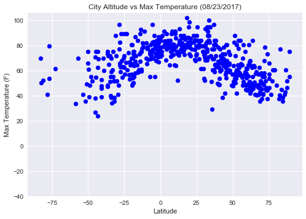
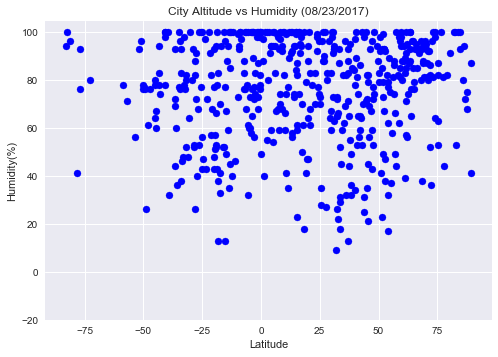
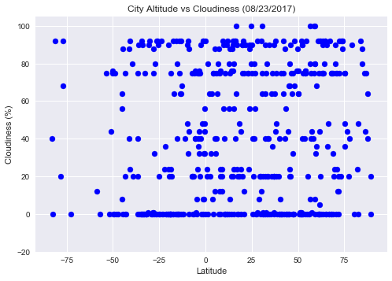
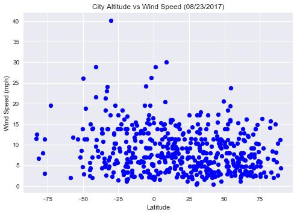

# WeatherPY

## Analysis
1) Temperature Decreases as the latitude increased across the geography
2) In majority of the cities humidity ranges from 60 to 100
3) In majority of the cities wind speed ranges from 2 to 8 mph


```python
#!pip install citipy
```

    Requirement already satisfied: citipy in c:\users\t_singsha\appdata\local\continuum\anaconda3\lib\site-packages
    Requirement already satisfied: kdtree>=0.12 in c:\users\t_singsha\appdata\local\continuum\anaconda3\lib\site-packages (from citipy)
    


```python
from citipy import citipy
```


```python
from random import uniform
import pandas as pd
import numpy as np
import csv
import random
import matplotlib.pyplot as plt
import requests as req
import json
import seaborn as sns
from datetime import datetime as dt
```

# Generate Cities Lat and Lng


```python
def newpoint():
    return uniform(-90,90), uniform(-180,180)

points = []
points = (newpoint() for x in range(1500))

# for x in points:
#     print(x)

columns = ("Lat", "Lng")
City_df = pd.DataFrame([x for x in points], columns=columns)
City_df.head()

```


<div>
<style>
    .dataframe thead tr:only-child th {
        text-align: right;
    }

    .dataframe thead th {
        text-align: left;
    }

    .dataframe tbody tr th {
        vertical-align: top;
    }
</style>
<table border="1" class="dataframe">
  <thead>
    <tr style="text-align: right;">
      <th></th>
      <th>Lat</th>
      <th>Lng</th>
    </tr>
  </thead>
  <tbody>
    <tr>
      <th>0</th>
      <td>-39.658454</td>
      <td>-129.889057</td>
    </tr>
    <tr>
      <th>1</th>
      <td>-54.093423</td>
      <td>-114.394525</td>
    </tr>
    <tr>
      <th>2</th>
      <td>-26.509095</td>
      <td>31.877932</td>
    </tr>
    <tr>
      <th>3</th>
      <td>-82.421188</td>
      <td>77.412390</td>
    </tr>
    <tr>
      <th>4</th>
      <td>84.529373</td>
      <td>63.642179</td>
    </tr>
  </tbody>
</table>
</div>


# Perform API Calls & Generate cities name


```python
City_df["City"] = ""
City_df["Country"] = ""
```


```python
for index, row in City_df.iterrows():
    city = citipy.nearest_city(row['Lat'], row['Lng']).city_name
    country = citipy.nearest_city(row['Lat'], row['Lng']).country_code
    City_df.set_value(index, "City", city)
    City_df.set_value(index, "Country", country)

```


```python
City_Sample = City_df.drop_duplicates(subset='City').sample(n=500).reset_index()
```


```python
City_Sample.count()
```


    index      500
    Lat        500
    Lng        500
    City       500
    Country    500
    dtype: int64


```python
City_Sample["Temp"] = ""
City_Sample["Humidity"] = ""
City_Sample["Date"] = ""
City_Sample["Wind Speed"] = ""
City_Sample["Cloudiness"] = ""
del City_Sample['index']
City_Sample.head()
```


<div>
<style>
    .dataframe thead tr:only-child th {
        text-align: right;
    }

    .dataframe thead th {
        text-align: left;
    }

    .dataframe tbody tr th {
        vertical-align: top;
    }
</style>
<table border="1" class="dataframe">
  <thead>
    <tr style="text-align: right;">
      <th></th>
      <th>Lat</th>
      <th>Lng</th>
      <th>City</th>
      <th>Country</th>
      <th>Temp</th>
      <th>Humidity</th>
      <th>Date</th>
      <th>Wind Speed</th>
      <th>Cloudiness</th>
    </tr>
  </thead>
  <tbody>
    <tr>
      <th>0</th>
      <td>-19.122915</td>
      <td>31.170900</td>
      <td>mvuma</td>
      <td>zw</td>
      <td></td>
      <td></td>
      <td></td>
      <td></td>
      <td></td>
    </tr>
    <tr>
      <th>1</th>
      <td>83.853091</td>
      <td>40.161730</td>
      <td>tumannyy</td>
      <td>ru</td>
      <td></td>
      <td></td>
      <td></td>
      <td></td>
      <td></td>
    </tr>
    <tr>
      <th>2</th>
      <td>13.301622</td>
      <td>92.167281</td>
      <td>port blair</td>
      <td>in</td>
      <td></td>
      <td></td>
      <td></td>
      <td></td>
      <td></td>
    </tr>
    <tr>
      <th>3</th>
      <td>-25.388624</td>
      <td>-29.258653</td>
      <td>vila velha</td>
      <td>br</td>
      <td></td>
      <td></td>
      <td></td>
      <td></td>
      <td></td>
    </tr>
    <tr>
      <th>4</th>
      <td>19.168420</td>
      <td>-107.813105</td>
      <td>tomatlan</td>
      <td>mx</td>
      <td></td>
      <td></td>
      <td></td>
      <td></td>
      <td></td>
    </tr>
  </tbody>
</table>
</div>


```python
api_key = "e49d4a61cb099e62e98803099b4e1591"
url = "http://api.openweathermap.org/data/2.5/weather?"
units = "Imperial"
```


```python
print("Beginning Data Retrieval")
counter = 0
for index, row in City_Sample.iterrows():
    target_url = "http://api.openweathermap.org/data/2.5/weather?units=%s&APPID=%s&q=%s" % (units,api_key, row['City'])
    cities_data = req.get(target_url).json()
    City_Sample.set_value(index, "Temp", cities_data["main"]["temp_max"])
    City_Sample.set_value(index, "Humidity", cities_data["main"]["humidity"])
    City_Sample.set_value(index, "Date", cities_data["dt"])
    City_Sample.set_value(index, "Wind Speed", cities_data["wind"]["speed"])
    City_Sample.set_value(index, "Cloudiness", cities_data["clouds"]["all"])
    counter = counter + 1
       
    print("------------------------")
    print("Proceesing Record : " , counter, '|' , cities_data["name"])
    print(target_url)

```

    Beginning Data Retrieval
    ------------------------
    Proceesing Record :  1 | Mvuma
    http://api.openweathermap.org/data/2.5/weather?units=Imperial&APPID=e49d4a61cb099e62e98803099b4e1591&q=mvuma
    ------------------------
    Proceesing Record :  2 | Teriberka
    http://api.openweathermap.org/data/2.5/weather?units=Imperial&APPID=e49d4a61cb099e62e98803099b4e1591&q=tumannyy
    ------------------------
    Proceesing Record :  3 | Port Blair
    http://api.openweathermap.org/data/2.5/weather?units=Imperial&APPID=e49d4a61cb099e62e98803099b4e1591&q=port blair
    ------------------------
    Proceesing Record :  4 | Vila Velha
    http://api.openweathermap.org/data/2.5/weather?units=Imperial&APPID=e49d4a61cb099e62e98803099b4e1591&q=vila velha
    ------------------------
    Proceesing Record :  5 | Tomatlan
    http://api.openweathermap.org/data/2.5/weather?units=Imperial&APPID=e49d4a61cb099e62e98803099b4e1591&q=tomatlan
    ------------------------
    Proceesing Record :  6 | Ternate
    http://api.openweathermap.org/data/2.5/weather?units=Imperial&APPID=e49d4a61cb099e62e98803099b4e1591&q=ternate
    ------------------------
    Proceesing Record :  7 | Utiel
    http://api.openweathermap.org/data/2.5/weather?units=Imperial&APPID=e49d4a61cb099e62e98803099b4e1591&q=utiel
    ------------------------
    Proceesing Record :  8 | Issa
    http://api.openweathermap.org/data/2.5/weather?units=Imperial&APPID=e49d4a61cb099e62e98803099b4e1591&q=issa
    ------------------------
    Proceesing Record :  9 | Rio Gallegos
    http://api.openweathermap.org/data/2.5/weather?units=Imperial&APPID=e49d4a61cb099e62e98803099b4e1591&q=rio gallegos
    ------------------------
    Proceesing Record :  10 | Guerrero Negro
    http://api.openweathermap.org/data/2.5/weather?units=Imperial&APPID=e49d4a61cb099e62e98803099b4e1591&q=guerrero negro
    ------------------------
    Proceesing Record :  11 | Harindanga
    http://api.openweathermap.org/data/2.5/weather?units=Imperial&APPID=e49d4a61cb099e62e98803099b4e1591&q=harindanga
    ------------------------
    Proceesing Record :  12 | Pala
    http://api.openweathermap.org/data/2.5/weather?units=Imperial&APPID=e49d4a61cb099e62e98803099b4e1591&q=pala
    ------------------------
    Proceesing Record :  13 | Satka
    http://api.openweathermap.org/data/2.5/weather?units=Imperial&APPID=e49d4a61cb099e62e98803099b4e1591&q=satka
    ------------------------
    Proceesing Record :  14 | Lasa
    http://api.openweathermap.org/data/2.5/weather?units=Imperial&APPID=e49d4a61cb099e62e98803099b4e1591&q=lasa
    ------------------------
    Proceesing Record :  15 | Paita
    http://api.openweathermap.org/data/2.5/weather?units=Imperial&APPID=e49d4a61cb099e62e98803099b4e1591&q=paita
    ------------------------
    Proceesing Record :  16 | Solnechnyy
    http://api.openweathermap.org/data/2.5/weather?units=Imperial&APPID=e49d4a61cb099e62e98803099b4e1591&q=solnechnyy
    ------------------------
    Proceesing Record :  17 | Vanimo
    http://api.openweathermap.org/data/2.5/weather?units=Imperial&APPID=e49d4a61cb099e62e98803099b4e1591&q=vanimo
    ------------------------
    Proceesing Record :  18 | Nisia Floresta
    http://api.openweathermap.org/data/2.5/weather?units=Imperial&APPID=e49d4a61cb099e62e98803099b4e1591&q=nisia floresta
    ------------------------
    Proceesing Record :  19 | Deputatskiy
    http://api.openweathermap.org/data/2.5/weather?units=Imperial&APPID=e49d4a61cb099e62e98803099b4e1591&q=deputatskiy
    ------------------------
    Proceesing Record :  20 | Kwekwe
    http://api.openweathermap.org/data/2.5/weather?units=Imperial&APPID=e49d4a61cb099e62e98803099b4e1591&q=kwekwe
    ------------------------
    Proceesing Record :  21 | Lashio
    http://api.openweathermap.org/data/2.5/weather?units=Imperial&APPID=e49d4a61cb099e62e98803099b4e1591&q=lashio
    ------------------------
    Proceesing Record :  22 | Gizo
    http://api.openweathermap.org/data/2.5/weather?units=Imperial&APPID=e49d4a61cb099e62e98803099b4e1591&q=gizo
    ------------------------
    Proceesing Record :  23 | Mooloolaba
    http://api.openweathermap.org/data/2.5/weather?units=Imperial&APPID=e49d4a61cb099e62e98803099b4e1591&q=kawana waters
    ------------------------
    Proceesing Record :  24 | Amli
    http://api.openweathermap.org/data/2.5/weather?units=Imperial&APPID=e49d4a61cb099e62e98803099b4e1591&q=amli
    ------------------------
    Proceesing Record :  25 | Hermanus
    http://api.openweathermap.org/data/2.5/weather?units=Imperial&APPID=e49d4a61cb099e62e98803099b4e1591&q=hermanus
    ------------------------
    Proceesing Record :  26 | Saint-Augustin
    http://api.openweathermap.org/data/2.5/weather?units=Imperial&APPID=e49d4a61cb099e62e98803099b4e1591&q=saint-augustin
    ------------------------
    Proceesing Record :  27 | Broome
    http://api.openweathermap.org/data/2.5/weather?units=Imperial&APPID=e49d4a61cb099e62e98803099b4e1591&q=broome
    ------------------------
    Proceesing Record :  28 | Alofi
    http://api.openweathermap.org/data/2.5/weather?units=Imperial&APPID=e49d4a61cb099e62e98803099b4e1591&q=alofi
    ------------------------
    Proceesing Record :  29 | Visnes
    http://api.openweathermap.org/data/2.5/weather?units=Imperial&APPID=e49d4a61cb099e62e98803099b4e1591&q=visnes
    ------------------------
    Proceesing Record :  30 | Madridejos
    http://api.openweathermap.org/data/2.5/weather?units=Imperial&APPID=e49d4a61cb099e62e98803099b4e1591&q=madridejos
    ------------------------
    Proceesing Record :  31 | Klamath Falls
    http://api.openweathermap.org/data/2.5/weather?units=Imperial&APPID=e49d4a61cb099e62e98803099b4e1591&q=klamath falls
    ------------------------
    Proceesing Record :  32 | Turukhansk
    http://api.openweathermap.org/data/2.5/weather?units=Imperial&APPID=e49d4a61cb099e62e98803099b4e1591&q=turukhansk
    ------------------------
    Proceesing Record :  33 | Haines Junction
    http://api.openweathermap.org/data/2.5/weather?units=Imperial&APPID=e49d4a61cb099e62e98803099b4e1591&q=haines junction
    ------------------------
    Proceesing Record :  34 | Zhangatas
    http://api.openweathermap.org/data/2.5/weather?units=Imperial&APPID=e49d4a61cb099e62e98803099b4e1591&q=zhanatas
    ------------------------
    Proceesing Record :  35 | Dunedin
    http://api.openweathermap.org/data/2.5/weather?units=Imperial&APPID=e49d4a61cb099e62e98803099b4e1591&q=dunedin
    ------------------------
    Proceesing Record :  36 | Janakpur Zone
    http://api.openweathermap.org/data/2.5/weather?units=Imperial&APPID=e49d4a61cb099e62e98803099b4e1591&q=dzhusaly
    ------------------------
    Proceesing Record :  37 | Salinopolis
    http://api.openweathermap.org/data/2.5/weather?units=Imperial&APPID=e49d4a61cb099e62e98803099b4e1591&q=salinopolis
    ------------------------
    Proceesing Record :  38 | Fare
    http://api.openweathermap.org/data/2.5/weather?units=Imperial&APPID=e49d4a61cb099e62e98803099b4e1591&q=fare
    ------------------------
    Proceesing Record :  39 | Pondaguitan
    http://api.openweathermap.org/data/2.5/weather?units=Imperial&APPID=e49d4a61cb099e62e98803099b4e1591&q=pundaguitan
    ------------------------
    Proceesing Record :  40 | Baherden
    http://api.openweathermap.org/data/2.5/weather?units=Imperial&APPID=e49d4a61cb099e62e98803099b4e1591&q=baherden
    ------------------------
    Proceesing Record :  41 | Vaini
    http://api.openweathermap.org/data/2.5/weather?units=Imperial&APPID=e49d4a61cb099e62e98803099b4e1591&q=vaini
    ------------------------
    Proceesing Record :  42 | Krasnyy Bor
    http://api.openweathermap.org/data/2.5/weather?units=Imperial&APPID=e49d4a61cb099e62e98803099b4e1591&q=nikolskoye
    ------------------------
    Proceesing Record :  43 | Hasaki
    http://api.openweathermap.org/data/2.5/weather?units=Imperial&APPID=e49d4a61cb099e62e98803099b4e1591&q=hasaki
    ------------------------
    Proceesing Record :  44 | Khorol
    http://api.openweathermap.org/data/2.5/weather?units=Imperial&APPID=e49d4a61cb099e62e98803099b4e1591&q=khorol
    ------------------------
    Proceesing Record :  45 | Ozamiz City
    http://api.openweathermap.org/data/2.5/weather?units=Imperial&APPID=e49d4a61cb099e62e98803099b4e1591&q=tabiauea
    ------------------------
    Proceesing Record :  46 | Teocuitatlan de Corona
    http://api.openweathermap.org/data/2.5/weather?units=Imperial&APPID=e49d4a61cb099e62e98803099b4e1591&q=teocuitatlan de corona
    ------------------------
    Proceesing Record :  47 | Vega de Alatorre
    http://api.openweathermap.org/data/2.5/weather?units=Imperial&APPID=e49d4a61cb099e62e98803099b4e1591&q=vega de alatorre
    ------------------------
    Proceesing Record :  48 | Qaanaaq
    http://api.openweathermap.org/data/2.5/weather?units=Imperial&APPID=e49d4a61cb099e62e98803099b4e1591&q=qaanaaq
    ------------------------
    Proceesing Record :  49 | Manzhouli
    http://api.openweathermap.org/data/2.5/weather?units=Imperial&APPID=e49d4a61cb099e62e98803099b4e1591&q=manzhouli
    ------------------------
    Proceesing Record :  50 | Husavik
    http://api.openweathermap.org/data/2.5/weather?units=Imperial&APPID=e49d4a61cb099e62e98803099b4e1591&q=husavik
    ------------------------
    Proceesing Record :  51 | Megion
    http://api.openweathermap.org/data/2.5/weather?units=Imperial&APPID=e49d4a61cb099e62e98803099b4e1591&q=megion
    ------------------------
    Proceesing Record :  52 | Shenkursk
    http://api.openweathermap.org/data/2.5/weather?units=Imperial&APPID=e49d4a61cb099e62e98803099b4e1591&q=shenkursk
    ------------------------
    Proceesing Record :  53 | Bibbiena
    http://api.openweathermap.org/data/2.5/weather?units=Imperial&APPID=e49d4a61cb099e62e98803099b4e1591&q=bibbiena
    ------------------------
    Proceesing Record :  54 | Bathsheba
    http://api.openweathermap.org/data/2.5/weather?units=Imperial&APPID=e49d4a61cb099e62e98803099b4e1591&q=bathsheba
    ------------------------
    Proceesing Record :  55 | Cockburn Town
    http://api.openweathermap.org/data/2.5/weather?units=Imperial&APPID=e49d4a61cb099e62e98803099b4e1591&q=cockburn town
    ------------------------
    Proceesing Record :  56 | Mitsamiouli
    http://api.openweathermap.org/data/2.5/weather?units=Imperial&APPID=e49d4a61cb099e62e98803099b4e1591&q=mitsamiouli
    ------------------------
    Proceesing Record :  57 | Goma
    http://api.openweathermap.org/data/2.5/weather?units=Imperial&APPID=e49d4a61cb099e62e98803099b4e1591&q=goma
    ------------------------
    Proceesing Record :  58 | Deep River
    http://api.openweathermap.org/data/2.5/weather?units=Imperial&APPID=e49d4a61cb099e62e98803099b4e1591&q=deep river
    ------------------------
    Proceesing Record :  59 | Bredasdorp
    http://api.openweathermap.org/data/2.5/weather?units=Imperial&APPID=e49d4a61cb099e62e98803099b4e1591&q=bredasdorp
    ------------------------
    Proceesing Record :  60 | Cherskiy
    http://api.openweathermap.org/data/2.5/weather?units=Imperial&APPID=e49d4a61cb099e62e98803099b4e1591&q=cherskiy
    ------------------------
    Proceesing Record :  61 | Cartagena
    http://api.openweathermap.org/data/2.5/weather?units=Imperial&APPID=e49d4a61cb099e62e98803099b4e1591&q=cartagena
    ------------------------
    Proceesing Record :  62 | Lebu
    http://api.openweathermap.org/data/2.5/weather?units=Imperial&APPID=e49d4a61cb099e62e98803099b4e1591&q=lebu
    ------------------------
    Proceesing Record :  63 | Yambio
    http://api.openweathermap.org/data/2.5/weather?units=Imperial&APPID=e49d4a61cb099e62e98803099b4e1591&q=yambio
    ------------------------
    Proceesing Record :  64 | Sinop
    http://api.openweathermap.org/data/2.5/weather?units=Imperial&APPID=e49d4a61cb099e62e98803099b4e1591&q=sinop
    ------------------------
    Proceesing Record :  65 | Samarai
    http://api.openweathermap.org/data/2.5/weather?units=Imperial&APPID=e49d4a61cb099e62e98803099b4e1591&q=alotau
    ------------------------
    Proceesing Record :  66 | Almaznyy
    http://api.openweathermap.org/data/2.5/weather?units=Imperial&APPID=e49d4a61cb099e62e98803099b4e1591&q=almaznyy
    ------------------------
    Proceesing Record :  67 | Port Hueneme
    http://api.openweathermap.org/data/2.5/weather?units=Imperial&APPID=e49d4a61cb099e62e98803099b4e1591&q=port hueneme
    ------------------------
    Proceesing Record :  68 | Tarusan
    http://api.openweathermap.org/data/2.5/weather?units=Imperial&APPID=e49d4a61cb099e62e98803099b4e1591&q=taburi
    ------------------------
    Proceesing Record :  69 | Paramonga
    http://api.openweathermap.org/data/2.5/weather?units=Imperial&APPID=e49d4a61cb099e62e98803099b4e1591&q=paramonga
    ------------------------
    Proceesing Record :  70 | Omaruru
    http://api.openweathermap.org/data/2.5/weather?units=Imperial&APPID=e49d4a61cb099e62e98803099b4e1591&q=omaruru
    ------------------------
    Proceesing Record :  71 | Siniscola
    http://api.openweathermap.org/data/2.5/weather?units=Imperial&APPID=e49d4a61cb099e62e98803099b4e1591&q=siniscola
    ------------------------
    Proceesing Record :  72 | Gialo
    http://api.openweathermap.org/data/2.5/weather?units=Imperial&APPID=e49d4a61cb099e62e98803099b4e1591&q=jalu
    ------------------------
    Proceesing Record :  73 | Odlabari
    http://api.openweathermap.org/data/2.5/weather?units=Imperial&APPID=e49d4a61cb099e62e98803099b4e1591&q=odlabari
    ------------------------
    Proceesing Record :  74 | Rio Cuarto
    http://api.openweathermap.org/data/2.5/weather?units=Imperial&APPID=e49d4a61cb099e62e98803099b4e1591&q=rio cuarto
    ------------------------
    Proceesing Record :  75 | Mao
    http://api.openweathermap.org/data/2.5/weather?units=Imperial&APPID=e49d4a61cb099e62e98803099b4e1591&q=mao
    ------------------------
    Proceesing Record :  76 | Humberto de Campos
    http://api.openweathermap.org/data/2.5/weather?units=Imperial&APPID=e49d4a61cb099e62e98803099b4e1591&q=humberto de campos
    ------------------------
    Proceesing Record :  77 | Dongsheng
    http://api.openweathermap.org/data/2.5/weather?units=Imperial&APPID=e49d4a61cb099e62e98803099b4e1591&q=dongsheng
    ------------------------
    Proceesing Record :  78 | Souillac
    http://api.openweathermap.org/data/2.5/weather?units=Imperial&APPID=e49d4a61cb099e62e98803099b4e1591&q=souillac
    ------------------------
    Proceesing Record :  79 | Racalmas
    http://api.openweathermap.org/data/2.5/weather?units=Imperial&APPID=e49d4a61cb099e62e98803099b4e1591&q=racalmas
    ------------------------
    Proceesing Record :  80 | Mwandiga
    http://api.openweathermap.org/data/2.5/weather?units=Imperial&APPID=e49d4a61cb099e62e98803099b4e1591&q=mwandiga
    ------------------------
    Proceesing Record :  81 | Saint George
    http://api.openweathermap.org/data/2.5/weather?units=Imperial&APPID=e49d4a61cb099e62e98803099b4e1591&q=saint george
    ------------------------
    Proceesing Record :  82 | Nuuk
    http://api.openweathermap.org/data/2.5/weather?units=Imperial&APPID=e49d4a61cb099e62e98803099b4e1591&q=nuuk
    ------------------------
    Proceesing Record :  83 | Phayakkhaphum Phisai
    http://api.openweathermap.org/data/2.5/weather?units=Imperial&APPID=e49d4a61cb099e62e98803099b4e1591&q=phayakkhaphum phisai
    ------------------------
    Proceesing Record :  84 | Alugan
    http://api.openweathermap.org/data/2.5/weather?units=Imperial&APPID=e49d4a61cb099e62e98803099b4e1591&q=alugan
    ------------------------
    Proceesing Record :  85 | Imbituba
    http://api.openweathermap.org/data/2.5/weather?units=Imperial&APPID=e49d4a61cb099e62e98803099b4e1591&q=imbituba
    ------------------------
    Proceesing Record :  86 | Yangambi
    http://api.openweathermap.org/data/2.5/weather?units=Imperial&APPID=e49d4a61cb099e62e98803099b4e1591&q=yangambi
    ------------------------
    Proceesing Record :  87 | Bandarbeyla
    http://api.openweathermap.org/data/2.5/weather?units=Imperial&APPID=e49d4a61cb099e62e98803099b4e1591&q=bandarbeyla
    ------------------------
    Proceesing Record :  88 | Vista Alegre
    http://api.openweathermap.org/data/2.5/weather?units=Imperial&APPID=e49d4a61cb099e62e98803099b4e1591&q=rolim de moura
    ------------------------
    Proceesing Record :  89 | Kahului
    http://api.openweathermap.org/data/2.5/weather?units=Imperial&APPID=e49d4a61cb099e62e98803099b4e1591&q=kahului
    ------------------------
    Proceesing Record :  90 | Majene
    http://api.openweathermap.org/data/2.5/weather?units=Imperial&APPID=e49d4a61cb099e62e98803099b4e1591&q=majene
    ------------------------
    Proceesing Record :  91 | Mehamn
    http://api.openweathermap.org/data/2.5/weather?units=Imperial&APPID=e49d4a61cb099e62e98803099b4e1591&q=mehamn
    ------------------------
    Proceesing Record :  92 | Tortoli
    http://api.openweathermap.org/data/2.5/weather?units=Imperial&APPID=e49d4a61cb099e62e98803099b4e1591&q=tortoli
    ------------------------
    Proceesing Record :  93 | Ridgecrest
    http://api.openweathermap.org/data/2.5/weather?units=Imperial&APPID=e49d4a61cb099e62e98803099b4e1591&q=ridgecrest
    ------------------------
    Proceesing Record :  94 | Middleton
    http://api.openweathermap.org/data/2.5/weather?units=Imperial&APPID=e49d4a61cb099e62e98803099b4e1591&q=middleton
    ------------------------
    Proceesing Record :  95 | Breda
    http://api.openweathermap.org/data/2.5/weather?units=Imperial&APPID=e49d4a61cb099e62e98803099b4e1591&q=bereda
    ------------------------
    Proceesing Record :  96 | Severo-Kurilsk
    http://api.openweathermap.org/data/2.5/weather?units=Imperial&APPID=e49d4a61cb099e62e98803099b4e1591&q=severo-kurilsk
    ------------------------
    Proceesing Record :  97 | Ranfurly
    http://api.openweathermap.org/data/2.5/weather?units=Imperial&APPID=e49d4a61cb099e62e98803099b4e1591&q=ranfurly
    ------------------------
    Proceesing Record :  98 | Necochea
    http://api.openweathermap.org/data/2.5/weather?units=Imperial&APPID=e49d4a61cb099e62e98803099b4e1591&q=necochea
    ------------------------
    Proceesing Record :  99 | Ocara
    http://api.openweathermap.org/data/2.5/weather?units=Imperial&APPID=e49d4a61cb099e62e98803099b4e1591&q=ocara
    ------------------------
    Proceesing Record :  100 | Kargil
    http://api.openweathermap.org/data/2.5/weather?units=Imperial&APPID=e49d4a61cb099e62e98803099b4e1591&q=kargil
    ------------------------
    Proceesing Record :  101 | Waingapu
    http://api.openweathermap.org/data/2.5/weather?units=Imperial&APPID=e49d4a61cb099e62e98803099b4e1591&q=waingapu
    ------------------------
    Proceesing Record :  102 | Mount Isa
    http://api.openweathermap.org/data/2.5/weather?units=Imperial&APPID=e49d4a61cb099e62e98803099b4e1591&q=mount isa
    ------------------------
    Proceesing Record :  103 | Veraval
    http://api.openweathermap.org/data/2.5/weather?units=Imperial&APPID=e49d4a61cb099e62e98803099b4e1591&q=veraval
    ------------------------
    Proceesing Record :  104 | La Ronge
    http://api.openweathermap.org/data/2.5/weather?units=Imperial&APPID=e49d4a61cb099e62e98803099b4e1591&q=la ronge
    ------------------------
    Proceesing Record :  105 | Pacific Grove
    http://api.openweathermap.org/data/2.5/weather?units=Imperial&APPID=e49d4a61cb099e62e98803099b4e1591&q=pacific grove
    ------------------------
    Proceesing Record :  106 | Awbari
    http://api.openweathermap.org/data/2.5/weather?units=Imperial&APPID=e49d4a61cb099e62e98803099b4e1591&q=awbari
    ------------------------
    Proceesing Record :  107 | Provideniya
    http://api.openweathermap.org/data/2.5/weather?units=Imperial&APPID=e49d4a61cb099e62e98803099b4e1591&q=provideniya
    ------------------------
    Proceesing Record :  108 | Shelburne
    http://api.openweathermap.org/data/2.5/weather?units=Imperial&APPID=e49d4a61cb099e62e98803099b4e1591&q=shelburne
    ------------------------
    Proceesing Record :  109 | Itamarandiba
    http://api.openweathermap.org/data/2.5/weather?units=Imperial&APPID=e49d4a61cb099e62e98803099b4e1591&q=itamarandiba
    ------------------------
    Proceesing Record :  110 | Longyan
    http://api.openweathermap.org/data/2.5/weather?units=Imperial&APPID=e49d4a61cb099e62e98803099b4e1591&q=longyan
    ------------------------
    Proceesing Record :  111 | Tawau
    http://api.openweathermap.org/data/2.5/weather?units=Imperial&APPID=e49d4a61cb099e62e98803099b4e1591&q=tawau
    ------------------------
    Proceesing Record :  112 | Cayhagan
    http://api.openweathermap.org/data/2.5/weather?units=Imperial&APPID=e49d4a61cb099e62e98803099b4e1591&q=cayhagan
    ------------------------
    Proceesing Record :  113 | Mikhaylovka
    http://api.openweathermap.org/data/2.5/weather?units=Imperial&APPID=e49d4a61cb099e62e98803099b4e1591&q=mikhaylovka
    ------------------------
    Proceesing Record :  114 | Lowicz
    http://api.openweathermap.org/data/2.5/weather?units=Imperial&APPID=e49d4a61cb099e62e98803099b4e1591&q=lowicz
    ------------------------
    Proceesing Record :  115 | Barah
    http://api.openweathermap.org/data/2.5/weather?units=Imperial&APPID=e49d4a61cb099e62e98803099b4e1591&q=umm ruwabah
    ------------------------
    Proceesing Record :  116 | Mandalgovi
    http://api.openweathermap.org/data/2.5/weather?units=Imperial&APPID=e49d4a61cb099e62e98803099b4e1591&q=mandalgovi
    ------------------------
    Proceesing Record :  117 | Maragogi
    http://api.openweathermap.org/data/2.5/weather?units=Imperial&APPID=e49d4a61cb099e62e98803099b4e1591&q=maragogi
    ------------------------
    Proceesing Record :  118 | Riberalta
    http://api.openweathermap.org/data/2.5/weather?units=Imperial&APPID=e49d4a61cb099e62e98803099b4e1591&q=riberalta
    ------------------------
    Proceesing Record :  119 | Flinders
    http://api.openweathermap.org/data/2.5/weather?units=Imperial&APPID=e49d4a61cb099e62e98803099b4e1591&q=flinders
    ------------------------
    Proceesing Record :  120 | Thinadhoo
    http://api.openweathermap.org/data/2.5/weather?units=Imperial&APPID=e49d4a61cb099e62e98803099b4e1591&q=thinadhoo
    ------------------------
    Proceesing Record :  121 | Shirokiy
    http://api.openweathermap.org/data/2.5/weather?units=Imperial&APPID=e49d4a61cb099e62e98803099b4e1591&q=shirokiy
    ------------------------
    Proceesing Record :  122 | Rajgarh
    http://api.openweathermap.org/data/2.5/weather?units=Imperial&APPID=e49d4a61cb099e62e98803099b4e1591&q=rajgarh
    ------------------------
    Proceesing Record :  123 | Golden
    http://api.openweathermap.org/data/2.5/weather?units=Imperial&APPID=e49d4a61cb099e62e98803099b4e1591&q=golden
    ------------------------
    Proceesing Record :  124 | Price
    http://api.openweathermap.org/data/2.5/weather?units=Imperial&APPID=e49d4a61cb099e62e98803099b4e1591&q=price
    ------------------------
    Proceesing Record :  125 | Barrow
    http://api.openweathermap.org/data/2.5/weather?units=Imperial&APPID=e49d4a61cb099e62e98803099b4e1591&q=barrow
    ------------------------
    Proceesing Record :  126 | Cabedelo
    http://api.openweathermap.org/data/2.5/weather?units=Imperial&APPID=e49d4a61cb099e62e98803099b4e1591&q=cabedelo
    ------------------------
    Proceesing Record :  127 | Coracora
    http://api.openweathermap.org/data/2.5/weather?units=Imperial&APPID=e49d4a61cb099e62e98803099b4e1591&q=coracora
    ------------------------
    Proceesing Record :  128 | Togur
    http://api.openweathermap.org/data/2.5/weather?units=Imperial&APPID=e49d4a61cb099e62e98803099b4e1591&q=togur
    ------------------------
    Proceesing Record :  129 | Shumikha
    http://api.openweathermap.org/data/2.5/weather?units=Imperial&APPID=e49d4a61cb099e62e98803099b4e1591&q=shumikha
    ------------------------
    Proceesing Record :  130 | Andros Town
    http://api.openweathermap.org/data/2.5/weather?units=Imperial&APPID=e49d4a61cb099e62e98803099b4e1591&q=andros town
    ------------------------
    Proceesing Record :  131 | Bijar
    http://api.openweathermap.org/data/2.5/weather?units=Imperial&APPID=e49d4a61cb099e62e98803099b4e1591&q=bijar
    ------------------------
    Proceesing Record :  132 | Kitimat
    http://api.openweathermap.org/data/2.5/weather?units=Imperial&APPID=e49d4a61cb099e62e98803099b4e1591&q=kitimat
    ------------------------
    Proceesing Record :  133 | Marfino
    http://api.openweathermap.org/data/2.5/weather?units=Imperial&APPID=e49d4a61cb099e62e98803099b4e1591&q=marfino
    ------------------------
    Proceesing Record :  134 | Cayenne
    http://api.openweathermap.org/data/2.5/weather?units=Imperial&APPID=e49d4a61cb099e62e98803099b4e1591&q=cayenne
    ------------------------
    Proceesing Record :  135 | Nyurba
    http://api.openweathermap.org/data/2.5/weather?units=Imperial&APPID=e49d4a61cb099e62e98803099b4e1591&q=nyurba
    ------------------------
    Proceesing Record :  136 | La Grande
    http://api.openweathermap.org/data/2.5/weather?units=Imperial&APPID=e49d4a61cb099e62e98803099b4e1591&q=la grande
    ------------------------
    Proceesing Record :  137 | Mackay
    http://api.openweathermap.org/data/2.5/weather?units=Imperial&APPID=e49d4a61cb099e62e98803099b4e1591&q=mackay
    ------------------------
    Proceesing Record :  138 | Butaritari
    http://api.openweathermap.org/data/2.5/weather?units=Imperial&APPID=e49d4a61cb099e62e98803099b4e1591&q=butaritari
    ------------------------
    Proceesing Record :  139 | Ulcinj
    http://api.openweathermap.org/data/2.5/weather?units=Imperial&APPID=e49d4a61cb099e62e98803099b4e1591&q=ulcinj
    ------------------------
    Proceesing Record :  140 | Fes
    http://api.openweathermap.org/data/2.5/weather?units=Imperial&APPID=e49d4a61cb099e62e98803099b4e1591&q=fez
    ------------------------
    Proceesing Record :  141 | Nago
    http://api.openweathermap.org/data/2.5/weather?units=Imperial&APPID=e49d4a61cb099e62e98803099b4e1591&q=nago
    ------------------------
    Proceesing Record :  142 | Shingu
    http://api.openweathermap.org/data/2.5/weather?units=Imperial&APPID=e49d4a61cb099e62e98803099b4e1591&q=shingu
    ------------------------
    Proceesing Record :  143 | Ekibastuz
    http://api.openweathermap.org/data/2.5/weather?units=Imperial&APPID=e49d4a61cb099e62e98803099b4e1591&q=ekibastuz
    ------------------------
    Proceesing Record :  144 | Swan Hill
    http://api.openweathermap.org/data/2.5/weather?units=Imperial&APPID=e49d4a61cb099e62e98803099b4e1591&q=swan hill
    ------------------------
    Proceesing Record :  145 | Shimoda
    http://api.openweathermap.org/data/2.5/weather?units=Imperial&APPID=e49d4a61cb099e62e98803099b4e1591&q=shimoda
    ------------------------
    Proceesing Record :  146 | Jinhua
    http://api.openweathermap.org/data/2.5/weather?units=Imperial&APPID=e49d4a61cb099e62e98803099b4e1591&q=samusu
    ------------------------
    Proceesing Record :  147 | Asau
    http://api.openweathermap.org/data/2.5/weather?units=Imperial&APPID=e49d4a61cb099e62e98803099b4e1591&q=asau
    ------------------------
    Proceesing Record :  148 | Guntakal
    http://api.openweathermap.org/data/2.5/weather?units=Imperial&APPID=e49d4a61cb099e62e98803099b4e1591&q=guntakal
    ------------------------
    Proceesing Record :  149 | Moosonee
    http://api.openweathermap.org/data/2.5/weather?units=Imperial&APPID=e49d4a61cb099e62e98803099b4e1591&q=moose factory
    ------------------------
    Proceesing Record :  150 | Half Moon Bay
    http://api.openweathermap.org/data/2.5/weather?units=Imperial&APPID=e49d4a61cb099e62e98803099b4e1591&q=half moon bay
    ------------------------
    Proceesing Record :  151 | Canora
    http://api.openweathermap.org/data/2.5/weather?units=Imperial&APPID=e49d4a61cb099e62e98803099b4e1591&q=canora
    ------------------------
    Proceesing Record :  152 | Ush-Tyube
    http://api.openweathermap.org/data/2.5/weather?units=Imperial&APPID=e49d4a61cb099e62e98803099b4e1591&q=ushtobe
    ------------------------
    Proceesing Record :  153 | Kinablangan
    http://api.openweathermap.org/data/2.5/weather?units=Imperial&APPID=e49d4a61cb099e62e98803099b4e1591&q=kinablangan
    ------------------------
    Proceesing Record :  154 | Ossora
    http://api.openweathermap.org/data/2.5/weather?units=Imperial&APPID=e49d4a61cb099e62e98803099b4e1591&q=ossora
    ------------------------
    Proceesing Record :  155 | Nhamunda
    http://api.openweathermap.org/data/2.5/weather?units=Imperial&APPID=e49d4a61cb099e62e98803099b4e1591&q=nhamunda
    ------------------------
    Proceesing Record :  156 | Saint-Georges
    http://api.openweathermap.org/data/2.5/weather?units=Imperial&APPID=e49d4a61cb099e62e98803099b4e1591&q=saint-georges
    ------------------------
    Proceesing Record :  157 | Buba
    http://api.openweathermap.org/data/2.5/weather?units=Imperial&APPID=e49d4a61cb099e62e98803099b4e1591&q=fulacunda
    ------------------------
    Proceesing Record :  158 | Iquique
    http://api.openweathermap.org/data/2.5/weather?units=Imperial&APPID=e49d4a61cb099e62e98803099b4e1591&q=iquique
    ------------------------
    Proceesing Record :  159 | Marystown
    http://api.openweathermap.org/data/2.5/weather?units=Imperial&APPID=e49d4a61cb099e62e98803099b4e1591&q=marystown
    ------------------------
    Proceesing Record :  160 | Clyde River
    http://api.openweathermap.org/data/2.5/weather?units=Imperial&APPID=e49d4a61cb099e62e98803099b4e1591&q=clyde river
    ------------------------
    Proceesing Record :  161 | Barrouallie
    http://api.openweathermap.org/data/2.5/weather?units=Imperial&APPID=e49d4a61cb099e62e98803099b4e1591&q=barroualie
    ------------------------
    Proceesing Record :  162 | Eregli
    http://api.openweathermap.org/data/2.5/weather?units=Imperial&APPID=e49d4a61cb099e62e98803099b4e1591&q=eregli
    ------------------------
    Proceesing Record :  163 | Saint-Joseph
    http://api.openweathermap.org/data/2.5/weather?units=Imperial&APPID=e49d4a61cb099e62e98803099b4e1591&q=saint-joseph
    ------------------------
    Proceesing Record :  164 | Saudarkrokur
    http://api.openweathermap.org/data/2.5/weather?units=Imperial&APPID=e49d4a61cb099e62e98803099b4e1591&q=skagastrond
    ------------------------
    Proceesing Record :  165 | Urengoy
    http://api.openweathermap.org/data/2.5/weather?units=Imperial&APPID=e49d4a61cb099e62e98803099b4e1591&q=urengoy
    ------------------------
    Proceesing Record :  166 | Grand Gaube
    http://api.openweathermap.org/data/2.5/weather?units=Imperial&APPID=e49d4a61cb099e62e98803099b4e1591&q=grand gaube
    ------------------------
    Proceesing Record :  167 | Lompoc
    http://api.openweathermap.org/data/2.5/weather?units=Imperial&APPID=e49d4a61cb099e62e98803099b4e1591&q=lompoc
    ------------------------
    Proceesing Record :  168 | Novobirilyussy
    http://api.openweathermap.org/data/2.5/weather?units=Imperial&APPID=e49d4a61cb099e62e98803099b4e1591&q=novobirilyussy
    ------------------------
    Proceesing Record :  169 | Avarua
    http://api.openweathermap.org/data/2.5/weather?units=Imperial&APPID=e49d4a61cb099e62e98803099b4e1591&q=avarua
    ------------------------
    Proceesing Record :  170 | Saint-Francois
    http://api.openweathermap.org/data/2.5/weather?units=Imperial&APPID=e49d4a61cb099e62e98803099b4e1591&q=saint-francois
    ------------------------
    Proceesing Record :  171 | Dalvik
    http://api.openweathermap.org/data/2.5/weather?units=Imperial&APPID=e49d4a61cb099e62e98803099b4e1591&q=dalvik
    ------------------------
    Proceesing Record :  172 | Serra
    http://api.openweathermap.org/data/2.5/weather?units=Imperial&APPID=e49d4a61cb099e62e98803099b4e1591&q=serra
    ------------------------
    Proceesing Record :  173 | Baijiantan
    http://api.openweathermap.org/data/2.5/weather?units=Imperial&APPID=e49d4a61cb099e62e98803099b4e1591&q=baijiantan
    ------------------------
    Proceesing Record :  174 | Yalinga
    http://api.openweathermap.org/data/2.5/weather?units=Imperial&APPID=e49d4a61cb099e62e98803099b4e1591&q=nguiu
    ------------------------
    Proceesing Record :  175 | Helsinki
    http://api.openweathermap.org/data/2.5/weather?units=Imperial&APPID=e49d4a61cb099e62e98803099b4e1591&q=lolua
    ------------------------
    Proceesing Record :  176 | Bethel
    http://api.openweathermap.org/data/2.5/weather?units=Imperial&APPID=e49d4a61cb099e62e98803099b4e1591&q=bethel
    ------------------------
    Proceesing Record :  177 | Busselton
    http://api.openweathermap.org/data/2.5/weather?units=Imperial&APPID=e49d4a61cb099e62e98803099b4e1591&q=busselton
    ------------------------
    Proceesing Record :  178 | Revda
    http://api.openweathermap.org/data/2.5/weather?units=Imperial&APPID=e49d4a61cb099e62e98803099b4e1591&q=revda
    ------------------------
    Proceesing Record :  179 | Atar
    http://api.openweathermap.org/data/2.5/weather?units=Imperial&APPID=e49d4a61cb099e62e98803099b4e1591&q=atar
    ------------------------
    Proceesing Record :  180 | Ilulissat
    http://api.openweathermap.org/data/2.5/weather?units=Imperial&APPID=e49d4a61cb099e62e98803099b4e1591&q=ilulissat
    ------------------------
    Proceesing Record :  181 | Brunsbuttel
    http://api.openweathermap.org/data/2.5/weather?units=Imperial&APPID=e49d4a61cb099e62e98803099b4e1591&q=brunsbuttel
    ------------------------
    Proceesing Record :  182 | Tezu
    http://api.openweathermap.org/data/2.5/weather?units=Imperial&APPID=e49d4a61cb099e62e98803099b4e1591&q=tezu
    ------------------------
    Proceesing Record :  183 | Pabianice
    http://api.openweathermap.org/data/2.5/weather?units=Imperial&APPID=e49d4a61cb099e62e98803099b4e1591&q=pabianice
    ------------------------
    Proceesing Record :  184 | Praia
    http://api.openweathermap.org/data/2.5/weather?units=Imperial&APPID=e49d4a61cb099e62e98803099b4e1591&q=praia
    ------------------------
    Proceesing Record :  185 | Krasnoshchekovo
    http://api.openweathermap.org/data/2.5/weather?units=Imperial&APPID=e49d4a61cb099e62e98803099b4e1591&q=krasnoshchekovo
    ------------------------
    Proceesing Record :  186 | Sitka
    http://api.openweathermap.org/data/2.5/weather?units=Imperial&APPID=e49d4a61cb099e62e98803099b4e1591&q=sitka
    ------------------------
    Proceesing Record :  187 | Loandjili
    http://api.openweathermap.org/data/2.5/weather?units=Imperial&APPID=e49d4a61cb099e62e98803099b4e1591&q=loandjili
    ------------------------
    Proceesing Record :  188 | Pisco
    http://api.openweathermap.org/data/2.5/weather?units=Imperial&APPID=e49d4a61cb099e62e98803099b4e1591&q=pisco
    ------------------------
    Proceesing Record :  189 | Pangody
    http://api.openweathermap.org/data/2.5/weather?units=Imperial&APPID=e49d4a61cb099e62e98803099b4e1591&q=pangody
    ------------------------
    Proceesing Record :  190 | Mathura
    http://api.openweathermap.org/data/2.5/weather?units=Imperial&APPID=e49d4a61cb099e62e98803099b4e1591&q=mataura
    ------------------------
    Proceesing Record :  191 | Sao Joao da Barra
    http://api.openweathermap.org/data/2.5/weather?units=Imperial&APPID=e49d4a61cb099e62e98803099b4e1591&q=sao joao da barra
    ------------------------
    Proceesing Record :  192 | Meulaboh
    http://api.openweathermap.org/data/2.5/weather?units=Imperial&APPID=e49d4a61cb099e62e98803099b4e1591&q=meulaboh
    ------------------------
    Proceesing Record :  193 | Coquimbo
    http://api.openweathermap.org/data/2.5/weather?units=Imperial&APPID=e49d4a61cb099e62e98803099b4e1591&q=coquimbo
    ------------------------
    Proceesing Record :  194 | Kashan
    http://api.openweathermap.org/data/2.5/weather?units=Imperial&APPID=e49d4a61cb099e62e98803099b4e1591&q=kashan
    ------------------------
    Proceesing Record :  195 | Muli
    http://api.openweathermap.org/data/2.5/weather?units=Imperial&APPID=e49d4a61cb099e62e98803099b4e1591&q=muli
    ------------------------
    Proceesing Record :  196 | Damaia
    http://api.openweathermap.org/data/2.5/weather?units=Imperial&APPID=e49d4a61cb099e62e98803099b4e1591&q=burica
    ------------------------
    Proceesing Record :  197 | Barenburg
    http://api.openweathermap.org/data/2.5/weather?units=Imperial&APPID=e49d4a61cb099e62e98803099b4e1591&q=barentsburg
    ------------------------
    Proceesing Record :  198 | Jamestown
    http://api.openweathermap.org/data/2.5/weather?units=Imperial&APPID=e49d4a61cb099e62e98803099b4e1591&q=jamestown
    ------------------------
    Proceesing Record :  199 | San Juan
    http://api.openweathermap.org/data/2.5/weather?units=Imperial&APPID=e49d4a61cb099e62e98803099b4e1591&q=marcona
    ------------------------
    Proceesing Record :  200 | Srednekolymsk
    http://api.openweathermap.org/data/2.5/weather?units=Imperial&APPID=e49d4a61cb099e62e98803099b4e1591&q=srednekolymsk
    ------------------------
    Proceesing Record :  201 | Westport
    http://api.openweathermap.org/data/2.5/weather?units=Imperial&APPID=e49d4a61cb099e62e98803099b4e1591&q=westport
    ------------------------
    Proceesing Record :  202 | Chapais
    http://api.openweathermap.org/data/2.5/weather?units=Imperial&APPID=e49d4a61cb099e62e98803099b4e1591&q=chapais
    ------------------------
    Proceesing Record :  203 | Ancud
    http://api.openweathermap.org/data/2.5/weather?units=Imperial&APPID=e49d4a61cb099e62e98803099b4e1591&q=ancud
    ------------------------
    Proceesing Record :  204 | Katsuura
    http://api.openweathermap.org/data/2.5/weather?units=Imperial&APPID=e49d4a61cb099e62e98803099b4e1591&q=katsuura
    ------------------------
    Proceesing Record :  205 | Leningradskiy
    http://api.openweathermap.org/data/2.5/weather?units=Imperial&APPID=e49d4a61cb099e62e98803099b4e1591&q=leningradskiy
    ------------------------
    Proceesing Record :  206 | Ateptsevo
    http://api.openweathermap.org/data/2.5/weather?units=Imperial&APPID=e49d4a61cb099e62e98803099b4e1591&q=kamenskoye
    ------------------------
    Proceesing Record :  207 | Karasjok
    http://api.openweathermap.org/data/2.5/weather?units=Imperial&APPID=e49d4a61cb099e62e98803099b4e1591&q=karasjok
    ------------------------
    Proceesing Record :  208 | Yellowknife
    http://api.openweathermap.org/data/2.5/weather?units=Imperial&APPID=e49d4a61cb099e62e98803099b4e1591&q=yellowknife
    ------------------------
    Proceesing Record :  209 | Tigzirt
    http://api.openweathermap.org/data/2.5/weather?units=Imperial&APPID=e49d4a61cb099e62e98803099b4e1591&q=tigzirt
    ------------------------
    Proceesing Record :  210 | Kindu
    http://api.openweathermap.org/data/2.5/weather?units=Imperial&APPID=e49d4a61cb099e62e98803099b4e1591&q=kindu
    ------------------------
    Proceesing Record :  211 | Saint-Nazaire
    http://api.openweathermap.org/data/2.5/weather?units=Imperial&APPID=e49d4a61cb099e62e98803099b4e1591&q=saint-nazaire
    ------------------------
    Proceesing Record :  212 | Rikitea
    http://api.openweathermap.org/data/2.5/weather?units=Imperial&APPID=e49d4a61cb099e62e98803099b4e1591&q=rikitea
    ------------------------
    Proceesing Record :  213 | Blythe
    http://api.openweathermap.org/data/2.5/weather?units=Imperial&APPID=e49d4a61cb099e62e98803099b4e1591&q=blythe
    ------------------------
    Proceesing Record :  214 | Nshamba
    http://api.openweathermap.org/data/2.5/weather?units=Imperial&APPID=e49d4a61cb099e62e98803099b4e1591&q=nshamba
    ------------------------
    Proceesing Record :  215 | Mahebourg
    http://api.openweathermap.org/data/2.5/weather?units=Imperial&APPID=e49d4a61cb099e62e98803099b4e1591&q=mahebourg
    ------------------------
    Proceesing Record :  216 | Omsukchan
    http://api.openweathermap.org/data/2.5/weather?units=Imperial&APPID=e49d4a61cb099e62e98803099b4e1591&q=omsukchan
    ------------------------
    Proceesing Record :  217 | Klaksvik
    http://api.openweathermap.org/data/2.5/weather?units=Imperial&APPID=e49d4a61cb099e62e98803099b4e1591&q=klaksvik
    ------------------------
    Proceesing Record :  218 | Siteki
    http://api.openweathermap.org/data/2.5/weather?units=Imperial&APPID=e49d4a61cb099e62e98803099b4e1591&q=siteki
    ------------------------
    Proceesing Record :  219 | Klën
    http://api.openweathermap.org/data/2.5/weather?units=Imperial&APPID=e49d4a61cb099e62e98803099b4e1591&q=ulyanovo
    ------------------------
    Proceesing Record :  220 | Lensk
    http://api.openweathermap.org/data/2.5/weather?units=Imperial&APPID=e49d4a61cb099e62e98803099b4e1591&q=lensk
    ------------------------
    Proceesing Record :  221 | Sola
    http://api.openweathermap.org/data/2.5/weather?units=Imperial&APPID=e49d4a61cb099e62e98803099b4e1591&q=sola
    ------------------------
    Proceesing Record :  222 | Udachnyy
    http://api.openweathermap.org/data/2.5/weather?units=Imperial&APPID=e49d4a61cb099e62e98803099b4e1591&q=udachnyy
    ------------------------
    Proceesing Record :  223 | Geraldton
    http://api.openweathermap.org/data/2.5/weather?units=Imperial&APPID=e49d4a61cb099e62e98803099b4e1591&q=geraldton
    ------------------------
    Proceesing Record :  224 | Ribeira Grande
    http://api.openweathermap.org/data/2.5/weather?units=Imperial&APPID=e49d4a61cb099e62e98803099b4e1591&q=ribeira grande
    ------------------------
    Proceesing Record :  225 | Severnoye
    http://api.openweathermap.org/data/2.5/weather?units=Imperial&APPID=e49d4a61cb099e62e98803099b4e1591&q=severnoye
    ------------------------
    Proceesing Record :  226 | Bartlesville
    http://api.openweathermap.org/data/2.5/weather?units=Imperial&APPID=e49d4a61cb099e62e98803099b4e1591&q=bartlesville
    ------------------------
    Proceesing Record :  227 | Russell
    http://api.openweathermap.org/data/2.5/weather?units=Imperial&APPID=e49d4a61cb099e62e98803099b4e1591&q=russell
    ------------------------
    Proceesing Record :  228 | Bengkulu
    http://api.openweathermap.org/data/2.5/weather?units=Imperial&APPID=e49d4a61cb099e62e98803099b4e1591&q=bengkulu
    ------------------------
    Proceesing Record :  229 | Lima
    http://api.openweathermap.org/data/2.5/weather?units=Imperial&APPID=e49d4a61cb099e62e98803099b4e1591&q=lima
    ------------------------
    Proceesing Record :  230 | Saint-Michel-des-Saints
    http://api.openweathermap.org/data/2.5/weather?units=Imperial&APPID=e49d4a61cb099e62e98803099b4e1591&q=saint-michel-des-saints
    ------------------------
    Proceesing Record :  231 | Fuling
    http://api.openweathermap.org/data/2.5/weather?units=Imperial&APPID=e49d4a61cb099e62e98803099b4e1591&q=fuling
    ------------------------
    Proceesing Record :  232 | Chokurdakh
    http://api.openweathermap.org/data/2.5/weather?units=Imperial&APPID=e49d4a61cb099e62e98803099b4e1591&q=chokurdakh
    ------------------------
    Proceesing Record :  233 | Thompson
    http://api.openweathermap.org/data/2.5/weather?units=Imperial&APPID=e49d4a61cb099e62e98803099b4e1591&q=thompson
    ------------------------
    Proceesing Record :  234 | Mayo
    http://api.openweathermap.org/data/2.5/weather?units=Imperial&APPID=e49d4a61cb099e62e98803099b4e1591&q=mayo
    ------------------------
    Proceesing Record :  235 | Lagos
    http://api.openweathermap.org/data/2.5/weather?units=Imperial&APPID=e49d4a61cb099e62e98803099b4e1591&q=lagos
    ------------------------
    Proceesing Record :  236 | Hofn
    http://api.openweathermap.org/data/2.5/weather?units=Imperial&APPID=e49d4a61cb099e62e98803099b4e1591&q=hofn
    ------------------------
    Proceesing Record :  237 | Sioux Lookout
    http://api.openweathermap.org/data/2.5/weather?units=Imperial&APPID=e49d4a61cb099e62e98803099b4e1591&q=sioux lookout
    ------------------------
    Proceesing Record :  238 | Yazd
    http://api.openweathermap.org/data/2.5/weather?units=Imperial&APPID=e49d4a61cb099e62e98803099b4e1591&q=yazd
    ------------------------
    Proceesing Record :  239 | Komsomolskiy
    http://api.openweathermap.org/data/2.5/weather?units=Imperial&APPID=e49d4a61cb099e62e98803099b4e1591&q=komsomolskiy
    ------------------------
    Proceesing Record :  240 | Bhachau
    http://api.openweathermap.org/data/2.5/weather?units=Imperial&APPID=e49d4a61cb099e62e98803099b4e1591&q=bhachau
    ------------------------
    Proceesing Record :  241 | San Patricio
    http://api.openweathermap.org/data/2.5/weather?units=Imperial&APPID=e49d4a61cb099e62e98803099b4e1591&q=san patricio
    ------------------------
    Proceesing Record :  242 | Yumen
    http://api.openweathermap.org/data/2.5/weather?units=Imperial&APPID=e49d4a61cb099e62e98803099b4e1591&q=yumen
    ------------------------
    Proceesing Record :  243 | Port Alfred
    http://api.openweathermap.org/data/2.5/weather?units=Imperial&APPID=e49d4a61cb099e62e98803099b4e1591&q=port alfred
    ------------------------
    Proceesing Record :  244 | Buchanan
    http://api.openweathermap.org/data/2.5/weather?units=Imperial&APPID=e49d4a61cb099e62e98803099b4e1591&q=buchanan
    ------------------------
    Proceesing Record :  245 | Namatanai
    http://api.openweathermap.org/data/2.5/weather?units=Imperial&APPID=e49d4a61cb099e62e98803099b4e1591&q=namatanai
    ------------------------
    Proceesing Record :  246 | Dwarka
    http://api.openweathermap.org/data/2.5/weather?units=Imperial&APPID=e49d4a61cb099e62e98803099b4e1591&q=dwarka
    ------------------------
    Proceesing Record :  247 | Ostrovnoy
    http://api.openweathermap.org/data/2.5/weather?units=Imperial&APPID=e49d4a61cb099e62e98803099b4e1591&q=ostrovnoy
    ------------------------
    Proceesing Record :  248 | Graaff-Reinet
    http://api.openweathermap.org/data/2.5/weather?units=Imperial&APPID=e49d4a61cb099e62e98803099b4e1591&q=graaff-reinet
    ------------------------
    Proceesing Record :  249 | Salalah
    http://api.openweathermap.org/data/2.5/weather?units=Imperial&APPID=e49d4a61cb099e62e98803099b4e1591&q=salalah
    ------------------------
    Proceesing Record :  250 | Arlit
    http://api.openweathermap.org/data/2.5/weather?units=Imperial&APPID=e49d4a61cb099e62e98803099b4e1591&q=arlit
    ------------------------
    Proceesing Record :  251 | Pregassona
    http://api.openweathermap.org/data/2.5/weather?units=Imperial&APPID=e49d4a61cb099e62e98803099b4e1591&q=pregassona
    ------------------------
    Proceesing Record :  252 | Bilibino
    http://api.openweathermap.org/data/2.5/weather?units=Imperial&APPID=e49d4a61cb099e62e98803099b4e1591&q=bilibino
    ------------------------
    Proceesing Record :  253 | Tsiombe
    http://api.openweathermap.org/data/2.5/weather?units=Imperial&APPID=e49d4a61cb099e62e98803099b4e1591&q=tsihombe
    ------------------------
    Proceesing Record :  254 | Lavrentiya
    http://api.openweathermap.org/data/2.5/weather?units=Imperial&APPID=e49d4a61cb099e62e98803099b4e1591&q=lavrentiya
    ------------------------
    Proceesing Record :  255 | Constitucion
    http://api.openweathermap.org/data/2.5/weather?units=Imperial&APPID=e49d4a61cb099e62e98803099b4e1591&q=constitucion
    ------------------------
    Proceesing Record :  256 | Qasigiannguit
    http://api.openweathermap.org/data/2.5/weather?units=Imperial&APPID=e49d4a61cb099e62e98803099b4e1591&q=qasigiannguit
    ------------------------
    Proceesing Record :  257 | Huilong
    http://api.openweathermap.org/data/2.5/weather?units=Imperial&APPID=e49d4a61cb099e62e98803099b4e1591&q=huilong
    ------------------------
    Proceesing Record :  258 | Pyryatyn
    http://api.openweathermap.org/data/2.5/weather?units=Imperial&APPID=e49d4a61cb099e62e98803099b4e1591&q=pyryatyn
    ------------------------
    Proceesing Record :  259 | Svetlaya
    http://api.openweathermap.org/data/2.5/weather?units=Imperial&APPID=e49d4a61cb099e62e98803099b4e1591&q=svetlaya
    ------------------------
    Proceesing Record :  260 | Zhangaqorghan
    http://api.openweathermap.org/data/2.5/weather?units=Imperial&APPID=e49d4a61cb099e62e98803099b4e1591&q=zhanakorgan
    ------------------------
    Proceesing Record :  261 | Narayanpet
    http://api.openweathermap.org/data/2.5/weather?units=Imperial&APPID=e49d4a61cb099e62e98803099b4e1591&q=narayanpet
    ------------------------
    Proceesing Record :  262 | Anloga
    http://api.openweathermap.org/data/2.5/weather?units=Imperial&APPID=e49d4a61cb099e62e98803099b4e1591&q=anloga
    ------------------------
    Proceesing Record :  263 | Baghdad
    http://api.openweathermap.org/data/2.5/weather?units=Imperial&APPID=e49d4a61cb099e62e98803099b4e1591&q=baghdad
    ------------------------
    Proceesing Record :  264 | Teguldet
    http://api.openweathermap.org/data/2.5/weather?units=Imperial&APPID=e49d4a61cb099e62e98803099b4e1591&q=teguldet
    ------------------------
    Proceesing Record :  265 | Tasiilaq
    http://api.openweathermap.org/data/2.5/weather?units=Imperial&APPID=e49d4a61cb099e62e98803099b4e1591&q=tasiilaq
    ------------------------
    Proceesing Record :  266 | Sur
    http://api.openweathermap.org/data/2.5/weather?units=Imperial&APPID=e49d4a61cb099e62e98803099b4e1591&q=sur
    ------------------------
    Proceesing Record :  267 | Korla
    http://api.openweathermap.org/data/2.5/weather?units=Imperial&APPID=e49d4a61cb099e62e98803099b4e1591&q=korla
    ------------------------
    Proceesing Record :  268 | Victoria
    http://api.openweathermap.org/data/2.5/weather?units=Imperial&APPID=e49d4a61cb099e62e98803099b4e1591&q=victoria
    ------------------------
    Proceesing Record :  269 | Lata
    http://api.openweathermap.org/data/2.5/weather?units=Imperial&APPID=e49d4a61cb099e62e98803099b4e1591&q=lata
    ------------------------
    Proceesing Record :  270 | Hobart
    http://api.openweathermap.org/data/2.5/weather?units=Imperial&APPID=e49d4a61cb099e62e98803099b4e1591&q=hobart
    ------------------------
    Proceesing Record :  271 | Kloulklubed
    http://api.openweathermap.org/data/2.5/weather?units=Imperial&APPID=e49d4a61cb099e62e98803099b4e1591&q=kloulklubed
    ------------------------
    Proceesing Record :  272 | Lazaro Cardenas
    http://api.openweathermap.org/data/2.5/weather?units=Imperial&APPID=e49d4a61cb099e62e98803099b4e1591&q=lazaro cardenas
    ------------------------
    Proceesing Record :  273 | Eyl
    http://api.openweathermap.org/data/2.5/weather?units=Imperial&APPID=e49d4a61cb099e62e98803099b4e1591&q=eyl
    ------------------------
    Proceesing Record :  274 | Tobruk
    http://api.openweathermap.org/data/2.5/weather?units=Imperial&APPID=e49d4a61cb099e62e98803099b4e1591&q=tubruq
    ------------------------
    Proceesing Record :  275 | Bud
    http://api.openweathermap.org/data/2.5/weather?units=Imperial&APPID=e49d4a61cb099e62e98803099b4e1591&q=bud
    ------------------------
    Proceesing Record :  276 | East London
    http://api.openweathermap.org/data/2.5/weather?units=Imperial&APPID=e49d4a61cb099e62e98803099b4e1591&q=east london
    ------------------------
    Proceesing Record :  277 | Surt
    http://api.openweathermap.org/data/2.5/weather?units=Imperial&APPID=e49d4a61cb099e62e98803099b4e1591&q=surt
    ------------------------
    Proceesing Record :  278 | Sambava
    http://api.openweathermap.org/data/2.5/weather?units=Imperial&APPID=e49d4a61cb099e62e98803099b4e1591&q=sambava
    ------------------------
    Proceesing Record :  279 | Macau
    http://api.openweathermap.org/data/2.5/weather?units=Imperial&APPID=e49d4a61cb099e62e98803099b4e1591&q=macau
    ------------------------
    Proceesing Record :  280 | Trevi
    http://api.openweathermap.org/data/2.5/weather?units=Imperial&APPID=e49d4a61cb099e62e98803099b4e1591&q=illoqqortoormiut
    ------------------------
    Proceesing Record :  281 | Rio Grande
    http://api.openweathermap.org/data/2.5/weather?units=Imperial&APPID=e49d4a61cb099e62e98803099b4e1591&q=rio grande
    ------------------------
    Proceesing Record :  282 | Teya
    http://api.openweathermap.org/data/2.5/weather?units=Imperial&APPID=e49d4a61cb099e62e98803099b4e1591&q=teya
    ------------------------
    Proceesing Record :  283 | Havelock
    http://api.openweathermap.org/data/2.5/weather?units=Imperial&APPID=e49d4a61cb099e62e98803099b4e1591&q=havelock
    ------------------------
    Proceesing Record :  284 | Punta Arenas
    http://api.openweathermap.org/data/2.5/weather?units=Imperial&APPID=e49d4a61cb099e62e98803099b4e1591&q=punta arenas
    ------------------------
    Proceesing Record :  285 | Wanaka
    http://api.openweathermap.org/data/2.5/weather?units=Imperial&APPID=e49d4a61cb099e62e98803099b4e1591&q=wanaka
    ------------------------
    Proceesing Record :  286 | Newton
    http://api.openweathermap.org/data/2.5/weather?units=Imperial&APPID=e49d4a61cb099e62e98803099b4e1591&q=newton
    ------------------------
    Proceesing Record :  287 | Yelets
    http://api.openweathermap.org/data/2.5/weather?units=Imperial&APPID=e49d4a61cb099e62e98803099b4e1591&q=yeletskiy
    ------------------------
    Proceesing Record :  288 | Vardo
    http://api.openweathermap.org/data/2.5/weather?units=Imperial&APPID=e49d4a61cb099e62e98803099b4e1591&q=vardo
    ------------------------
    Proceesing Record :  289 | Makakilo City
    http://api.openweathermap.org/data/2.5/weather?units=Imperial&APPID=e49d4a61cb099e62e98803099b4e1591&q=makakilo city
    ------------------------
    Proceesing Record :  290 | Gibson
    http://api.openweathermap.org/data/2.5/weather?units=Imperial&APPID=e49d4a61cb099e62e98803099b4e1591&q=avera
    ------------------------
    Proceesing Record :  291 | Pevek
    http://api.openweathermap.org/data/2.5/weather?units=Imperial&APPID=e49d4a61cb099e62e98803099b4e1591&q=pevek
    ------------------------
    Proceesing Record :  292 | New Waterford
    http://api.openweathermap.org/data/2.5/weather?units=Imperial&APPID=e49d4a61cb099e62e98803099b4e1591&q=new waterford
    ------------------------
    Proceesing Record :  293 | Aksha
    http://api.openweathermap.org/data/2.5/weather?units=Imperial&APPID=e49d4a61cb099e62e98803099b4e1591&q=aksha
    ------------------------
    Proceesing Record :  294 | Karakol
    http://api.openweathermap.org/data/2.5/weather?units=Imperial&APPID=e49d4a61cb099e62e98803099b4e1591&q=karakol
    ------------------------
    Proceesing Record :  295 | Doba
    http://api.openweathermap.org/data/2.5/weather?units=Imperial&APPID=e49d4a61cb099e62e98803099b4e1591&q=doba
    ------------------------
    Proceesing Record :  296 | Iquitos
    http://api.openweathermap.org/data/2.5/weather?units=Imperial&APPID=e49d4a61cb099e62e98803099b4e1591&q=iquitos
    ------------------------
    Proceesing Record :  297 | Mtambile
    http://api.openweathermap.org/data/2.5/weather?units=Imperial&APPID=e49d4a61cb099e62e98803099b4e1591&q=mtambile
    ------------------------
    Proceesing Record :  298 | Rudnik
    http://api.openweathermap.org/data/2.5/weather?units=Imperial&APPID=e49d4a61cb099e62e98803099b4e1591&q=amderma
    ------------------------
    Proceesing Record :  299 | Kruisfontein
    http://api.openweathermap.org/data/2.5/weather?units=Imperial&APPID=e49d4a61cb099e62e98803099b4e1591&q=kruisfontein
    ------------------------
    Proceesing Record :  300 | Luderitz
    http://api.openweathermap.org/data/2.5/weather?units=Imperial&APPID=e49d4a61cb099e62e98803099b4e1591&q=luderitz
    ------------------------
    Proceesing Record :  301 | Longyearbyen
    http://api.openweathermap.org/data/2.5/weather?units=Imperial&APPID=e49d4a61cb099e62e98803099b4e1591&q=longyearbyen
    ------------------------
    Proceesing Record :  302 | Kieta
    http://api.openweathermap.org/data/2.5/weather?units=Imperial&APPID=e49d4a61cb099e62e98803099b4e1591&q=kieta
    ------------------------
    Proceesing Record :  303 | Colquechaca
    http://api.openweathermap.org/data/2.5/weather?units=Imperial&APPID=e49d4a61cb099e62e98803099b4e1591&q=colquechaca
    ------------------------
    Proceesing Record :  304 | Mildura
    http://api.openweathermap.org/data/2.5/weather?units=Imperial&APPID=e49d4a61cb099e62e98803099b4e1591&q=mildura
    ------------------------
    Proceesing Record :  305 | Wanning
    http://api.openweathermap.org/data/2.5/weather?units=Imperial&APPID=e49d4a61cb099e62e98803099b4e1591&q=wanning
    ------------------------
    Proceesing Record :  306 | Nemuro
    http://api.openweathermap.org/data/2.5/weather?units=Imperial&APPID=e49d4a61cb099e62e98803099b4e1591&q=nemuro
    ------------------------
    Proceesing Record :  307 | Nekhayevskiy
    http://api.openweathermap.org/data/2.5/weather?units=Imperial&APPID=e49d4a61cb099e62e98803099b4e1591&q=nekhayevskiy
    ------------------------
    Proceesing Record :  308 | Nantucket
    http://api.openweathermap.org/data/2.5/weather?units=Imperial&APPID=e49d4a61cb099e62e98803099b4e1591&q=nantucket
    ------------------------
    Proceesing Record :  309 | Pokhara
    http://api.openweathermap.org/data/2.5/weather?units=Imperial&APPID=e49d4a61cb099e62e98803099b4e1591&q=pokhara
    ------------------------
    Proceesing Record :  310 | San Miguel de Cozumel
    http://api.openweathermap.org/data/2.5/weather?units=Imperial&APPID=e49d4a61cb099e62e98803099b4e1591&q=cozumel
    ------------------------
    Proceesing Record :  311 | Tuktoyaktuk
    http://api.openweathermap.org/data/2.5/weather?units=Imperial&APPID=e49d4a61cb099e62e98803099b4e1591&q=tuktoyaktuk
    ------------------------
    Proceesing Record :  312 | Iqaluit
    http://api.openweathermap.org/data/2.5/weather?units=Imperial&APPID=e49d4a61cb099e62e98803099b4e1591&q=iqaluit
    ------------------------
    Proceesing Record :  313 | Dharchula
    http://api.openweathermap.org/data/2.5/weather?units=Imperial&APPID=e49d4a61cb099e62e98803099b4e1591&q=dharchula
    ------------------------
    Proceesing Record :  314 | Zyryanskoye
    http://api.openweathermap.org/data/2.5/weather?units=Imperial&APPID=e49d4a61cb099e62e98803099b4e1591&q=zyryanskoye
    ------------------------
    Proceesing Record :  315 | Santa Maria
    http://api.openweathermap.org/data/2.5/weather?units=Imperial&APPID=e49d4a61cb099e62e98803099b4e1591&q=santa maria
    ------------------------
    Proceesing Record :  316 | Pangnirtung
    http://api.openweathermap.org/data/2.5/weather?units=Imperial&APPID=e49d4a61cb099e62e98803099b4e1591&q=pangnirtung
    ------------------------
    Proceesing Record :  317 | Port Hedland
    http://api.openweathermap.org/data/2.5/weather?units=Imperial&APPID=e49d4a61cb099e62e98803099b4e1591&q=port hedland
    ------------------------
    Proceesing Record :  318 | Shawinigan
    http://api.openweathermap.org/data/2.5/weather?units=Imperial&APPID=e49d4a61cb099e62e98803099b4e1591&q=shawinigan
    ------------------------
    Proceesing Record :  319 | Terrace
    http://api.openweathermap.org/data/2.5/weather?units=Imperial&APPID=e49d4a61cb099e62e98803099b4e1591&q=terrace
    ------------------------
    Proceesing Record :  320 | Yeniseysk
    http://api.openweathermap.org/data/2.5/weather?units=Imperial&APPID=e49d4a61cb099e62e98803099b4e1591&q=yeniseysk
    ------------------------
    Proceesing Record :  321 | San Lorenzo
    http://api.openweathermap.org/data/2.5/weather?units=Imperial&APPID=e49d4a61cb099e62e98803099b4e1591&q=doctor pedro p. pena
    ------------------------
    Proceesing Record :  322 | Upernavik
    http://api.openweathermap.org/data/2.5/weather?units=Imperial&APPID=e49d4a61cb099e62e98803099b4e1591&q=upernavik
    ------------------------
    Proceesing Record :  323 | Victoria Falls
    http://api.openweathermap.org/data/2.5/weather?units=Imperial&APPID=e49d4a61cb099e62e98803099b4e1591&q=victoria falls
    ------------------------
    Proceesing Record :  324 | Burnie
    http://api.openweathermap.org/data/2.5/weather?units=Imperial&APPID=e49d4a61cb099e62e98803099b4e1591&q=burnie
    ------------------------
    Proceesing Record :  325 | Byron Bay
    http://api.openweathermap.org/data/2.5/weather?units=Imperial&APPID=e49d4a61cb099e62e98803099b4e1591&q=byron bay
    ------------------------
    Proceesing Record :  326 | Bom Jesus
    http://api.openweathermap.org/data/2.5/weather?units=Imperial&APPID=e49d4a61cb099e62e98803099b4e1591&q=axixa do tocantins
    ------------------------
    Proceesing Record :  327 | Hosszupalyi
    http://api.openweathermap.org/data/2.5/weather?units=Imperial&APPID=e49d4a61cb099e62e98803099b4e1591&q=hosszupalyi
    ------------------------
    Proceesing Record :  328 | Sept-Iles
    http://api.openweathermap.org/data/2.5/weather?units=Imperial&APPID=e49d4a61cb099e62e98803099b4e1591&q=sept-iles
    ------------------------
    Proceesing Record :  329 | Ahipara
    http://api.openweathermap.org/data/2.5/weather?units=Imperial&APPID=e49d4a61cb099e62e98803099b4e1591&q=ahipara
    ------------------------
    Proceesing Record :  330 | Nerchinskiy Zavod
    http://api.openweathermap.org/data/2.5/weather?units=Imperial&APPID=e49d4a61cb099e62e98803099b4e1591&q=nerchinskiy zavod
    ------------------------
    Proceesing Record :  331 | Khatanga
    http://api.openweathermap.org/data/2.5/weather?units=Imperial&APPID=e49d4a61cb099e62e98803099b4e1591&q=khatanga
    ------------------------
    Proceesing Record :  332 | Kaeo
    http://api.openweathermap.org/data/2.5/weather?units=Imperial&APPID=e49d4a61cb099e62e98803099b4e1591&q=kaeo
    ------------------------
    Proceesing Record :  333 | Asuncion
    http://api.openweathermap.org/data/2.5/weather?units=Imperial&APPID=e49d4a61cb099e62e98803099b4e1591&q=asuncion
    ------------------------
    Proceesing Record :  334 | Lorengau
    http://api.openweathermap.org/data/2.5/weather?units=Imperial&APPID=e49d4a61cb099e62e98803099b4e1591&q=lorengau
    ------------------------
    Proceesing Record :  335 | Tres Arroyos
    http://api.openweathermap.org/data/2.5/weather?units=Imperial&APPID=e49d4a61cb099e62e98803099b4e1591&q=tres arroyos
    ------------------------
    Proceesing Record :  336 | Menongue
    http://api.openweathermap.org/data/2.5/weather?units=Imperial&APPID=e49d4a61cb099e62e98803099b4e1591&q=menongue
    ------------------------
    Proceesing Record :  337 | Zhezqazghan
    http://api.openweathermap.org/data/2.5/weather?units=Imperial&APPID=e49d4a61cb099e62e98803099b4e1591&q=zhezkazgan
    ------------------------
    Proceesing Record :  338 | Mecca
    http://api.openweathermap.org/data/2.5/weather?units=Imperial&APPID=e49d4a61cb099e62e98803099b4e1591&q=mecca
    ------------------------
    Proceesing Record :  339 | Te Anau
    http://api.openweathermap.org/data/2.5/weather?units=Imperial&APPID=e49d4a61cb099e62e98803099b4e1591&q=te anau
    ------------------------
    Proceesing Record :  340 | Marti
    http://api.openweathermap.org/data/2.5/weather?units=Imperial&APPID=e49d4a61cb099e62e98803099b4e1591&q=marti
    ------------------------
    Proceesing Record :  341 | Acajutla
    http://api.openweathermap.org/data/2.5/weather?units=Imperial&APPID=e49d4a61cb099e62e98803099b4e1591&q=acajutla
    ------------------------
    Proceesing Record :  342 | Canico
    http://api.openweathermap.org/data/2.5/weather?units=Imperial&APPID=e49d4a61cb099e62e98803099b4e1591&q=canico
    ------------------------
    Proceesing Record :  343 | Oneonta
    http://api.openweathermap.org/data/2.5/weather?units=Imperial&APPID=e49d4a61cb099e62e98803099b4e1591&q=oneonta
    ------------------------
    Proceesing Record :  344 | Simpang
    http://api.openweathermap.org/data/2.5/weather?units=Imperial&APPID=e49d4a61cb099e62e98803099b4e1591&q=simpang
    ------------------------
    Proceesing Record :  345 | El Trompillo
    http://api.openweathermap.org/data/2.5/weather?units=Imperial&APPID=e49d4a61cb099e62e98803099b4e1591&q=vaitupu
    ------------------------
    Proceesing Record :  346 | Muḩāfaz̧at Dahūk
    http://api.openweathermap.org/data/2.5/weather?units=Imperial&APPID=e49d4a61cb099e62e98803099b4e1591&q=bargal
    ------------------------
    Proceesing Record :  347 | Cassilandia
    http://api.openweathermap.org/data/2.5/weather?units=Imperial&APPID=e49d4a61cb099e62e98803099b4e1591&q=cassilandia
    ------------------------
    Proceesing Record :  348 | Antofagasta
    http://api.openweathermap.org/data/2.5/weather?units=Imperial&APPID=e49d4a61cb099e62e98803099b4e1591&q=antofagasta
    ------------------------
    Proceesing Record :  349 | Miedzyrzec Podlaski
    http://api.openweathermap.org/data/2.5/weather?units=Imperial&APPID=e49d4a61cb099e62e98803099b4e1591&q=miedzyrzec podlaski
    ------------------------
    Proceesing Record :  350 | Hanko
    http://api.openweathermap.org/data/2.5/weather?units=Imperial&APPID=e49d4a61cb099e62e98803099b4e1591&q=hanko
    ------------------------
    Proceesing Record :  351 | Sereflikochisar
    http://api.openweathermap.org/data/2.5/weather?units=Imperial&APPID=e49d4a61cb099e62e98803099b4e1591&q=sereflikochisar
    ------------------------
    Proceesing Record :  352 | Pimentel
    http://api.openweathermap.org/data/2.5/weather?units=Imperial&APPID=e49d4a61cb099e62e98803099b4e1591&q=pimentel
    ------------------------
    Proceesing Record :  353 | Alihe
    http://api.openweathermap.org/data/2.5/weather?units=Imperial&APPID=e49d4a61cb099e62e98803099b4e1591&q=alihe
    ------------------------
    Proceesing Record :  354 | Trujillo
    http://api.openweathermap.org/data/2.5/weather?units=Imperial&APPID=e49d4a61cb099e62e98803099b4e1591&q=trujillo
    ------------------------
    Proceesing Record :  355 | College
    http://api.openweathermap.org/data/2.5/weather?units=Imperial&APPID=e49d4a61cb099e62e98803099b4e1591&q=college
    ------------------------
    Proceesing Record :  356 | Ponta Delgada
    http://api.openweathermap.org/data/2.5/weather?units=Imperial&APPID=e49d4a61cb099e62e98803099b4e1591&q=ponta delgada
    ------------------------
    Proceesing Record :  357 | Roma
    http://api.openweathermap.org/data/2.5/weather?units=Imperial&APPID=e49d4a61cb099e62e98803099b4e1591&q=roma
    ------------------------
    Proceesing Record :  358 | General Pico
    http://api.openweathermap.org/data/2.5/weather?units=Imperial&APPID=e49d4a61cb099e62e98803099b4e1591&q=general pico
    ------------------------
    Proceesing Record :  359 | Soderhamn
    http://api.openweathermap.org/data/2.5/weather?units=Imperial&APPID=e49d4a61cb099e62e98803099b4e1591&q=soderhamn
    ------------------------
    Proceesing Record :  360 | Mineral Wells
    http://api.openweathermap.org/data/2.5/weather?units=Imperial&APPID=e49d4a61cb099e62e98803099b4e1591&q=mineral wells
    ------------------------
    Proceesing Record :  361 | Raga
    http://api.openweathermap.org/data/2.5/weather?units=Imperial&APPID=e49d4a61cb099e62e98803099b4e1591&q=raga
    ------------------------
    Proceesing Record :  362 | Sorland
    http://api.openweathermap.org/data/2.5/weather?units=Imperial&APPID=e49d4a61cb099e62e98803099b4e1591&q=sorland
    ------------------------
    Proceesing Record :  363 | Atambua
    http://api.openweathermap.org/data/2.5/weather?units=Imperial&APPID=e49d4a61cb099e62e98803099b4e1591&q=atambua
    ------------------------
    Proceesing Record :  364 | Narsaq
    http://api.openweathermap.org/data/2.5/weather?units=Imperial&APPID=e49d4a61cb099e62e98803099b4e1591&q=narsaq
    ------------------------
    Proceesing Record :  365 | Sinnamary
    http://api.openweathermap.org/data/2.5/weather?units=Imperial&APPID=e49d4a61cb099e62e98803099b4e1591&q=sinnamary
    ------------------------
    Proceesing Record :  366 | Hilo
    http://api.openweathermap.org/data/2.5/weather?units=Imperial&APPID=e49d4a61cb099e62e98803099b4e1591&q=hilo
    ------------------------
    Proceesing Record :  367 | Teahupoo
    http://api.openweathermap.org/data/2.5/weather?units=Imperial&APPID=e49d4a61cb099e62e98803099b4e1591&q=teahupoo
    ------------------------
    Proceesing Record :  368 | Mananjary
    http://api.openweathermap.org/data/2.5/weather?units=Imperial&APPID=e49d4a61cb099e62e98803099b4e1591&q=mananjary
    ------------------------
    Proceesing Record :  369 | Gorontalo
    http://api.openweathermap.org/data/2.5/weather?units=Imperial&APPID=e49d4a61cb099e62e98803099b4e1591&q=gorontalo
    ------------------------
    Proceesing Record :  370 | Balclutha
    http://api.openweathermap.org/data/2.5/weather?units=Imperial&APPID=e49d4a61cb099e62e98803099b4e1591&q=kaitangata
    ------------------------
    Proceesing Record :  371 | Linguère
    http://api.openweathermap.org/data/2.5/weather?units=Imperial&APPID=e49d4a61cb099e62e98803099b4e1591&q=linguere
    ------------------------
    Proceesing Record :  372 | Oranjemund
    http://api.openweathermap.org/data/2.5/weather?units=Imperial&APPID=e49d4a61cb099e62e98803099b4e1591&q=oranjemund
    ------------------------
    Proceesing Record :  373 | Gunnedah
    http://api.openweathermap.org/data/2.5/weather?units=Imperial&APPID=e49d4a61cb099e62e98803099b4e1591&q=gunnedah
    ------------------------
    Proceesing Record :  374 | Norman Wells
    http://api.openweathermap.org/data/2.5/weather?units=Imperial&APPID=e49d4a61cb099e62e98803099b4e1591&q=norman wells
    ------------------------
    Proceesing Record :  375 | Ofaqim
    http://api.openweathermap.org/data/2.5/weather?units=Imperial&APPID=e49d4a61cb099e62e98803099b4e1591&q=ofaqim
    ------------------------
    Proceesing Record :  376 | Kholodnyy
    http://api.openweathermap.org/data/2.5/weather?units=Imperial&APPID=e49d4a61cb099e62e98803099b4e1591&q=kholodnyy
    ------------------------
    Proceesing Record :  377 | Cidreira
    http://api.openweathermap.org/data/2.5/weather?units=Imperial&APPID=e49d4a61cb099e62e98803099b4e1591&q=cidreira
    ------------------------
    Proceesing Record :  378 | Arraial do Cabo
    http://api.openweathermap.org/data/2.5/weather?units=Imperial&APPID=e49d4a61cb099e62e98803099b4e1591&q=arraial do cabo
    ------------------------
    Proceesing Record :  379 | Saskylakh
    http://api.openweathermap.org/data/2.5/weather?units=Imperial&APPID=e49d4a61cb099e62e98803099b4e1591&q=saskylakh
    ------------------------
    Proceesing Record :  380 | Zhihe
    http://api.openweathermap.org/data/2.5/weather?units=Imperial&APPID=e49d4a61cb099e62e98803099b4e1591&q=yanchukan
    ------------------------
    Proceesing Record :  381 | Isangel
    http://api.openweathermap.org/data/2.5/weather?units=Imperial&APPID=e49d4a61cb099e62e98803099b4e1591&q=isangel
    ------------------------
    Proceesing Record :  382 | Tutoia
    http://api.openweathermap.org/data/2.5/weather?units=Imperial&APPID=e49d4a61cb099e62e98803099b4e1591&q=tutoia
    ------------------------
    Proceesing Record :  383 | Belyy Yar
    http://api.openweathermap.org/data/2.5/weather?units=Imperial&APPID=e49d4a61cb099e62e98803099b4e1591&q=belyy yar
    ------------------------
    Proceesing Record :  384 | Tolaga Bay
    http://api.openweathermap.org/data/2.5/weather?units=Imperial&APPID=e49d4a61cb099e62e98803099b4e1591&q=ruatoria
    ------------------------
    Proceesing Record :  385 | Odugattur
    http://api.openweathermap.org/data/2.5/weather?units=Imperial&APPID=e49d4a61cb099e62e98803099b4e1591&q=odugathur
    ------------------------
    Proceesing Record :  386 | Asti
    http://api.openweathermap.org/data/2.5/weather?units=Imperial&APPID=e49d4a61cb099e62e98803099b4e1591&q=asfi
    ------------------------
    Proceesing Record :  387 | Roura
    http://api.openweathermap.org/data/2.5/weather?units=Imperial&APPID=e49d4a61cb099e62e98803099b4e1591&q=roura
    ------------------------
    Proceesing Record :  388 | Zhigansk
    http://api.openweathermap.org/data/2.5/weather?units=Imperial&APPID=e49d4a61cb099e62e98803099b4e1591&q=zhigansk
    ------------------------
    Proceesing Record :  389 | Vikindu
    http://api.openweathermap.org/data/2.5/weather?units=Imperial&APPID=e49d4a61cb099e62e98803099b4e1591&q=vikindu
    ------------------------
    Proceesing Record :  390 | Fortuna
    http://api.openweathermap.org/data/2.5/weather?units=Imperial&APPID=e49d4a61cb099e62e98803099b4e1591&q=fortuna
    ------------------------
    Proceesing Record :  391 | Flin Flon
    http://api.openweathermap.org/data/2.5/weather?units=Imperial&APPID=e49d4a61cb099e62e98803099b4e1591&q=flin flon
    ------------------------
    Proceesing Record :  392 | Sham Churasi
    http://api.openweathermap.org/data/2.5/weather?units=Imperial&APPID=e49d4a61cb099e62e98803099b4e1591&q=saleaula
    ------------------------
    Proceesing Record :  393 | Port Lincoln
    http://api.openweathermap.org/data/2.5/weather?units=Imperial&APPID=e49d4a61cb099e62e98803099b4e1591&q=port lincoln
    ------------------------
    Proceesing Record :  394 | Krasnoarmeysk
    http://api.openweathermap.org/data/2.5/weather?units=Imperial&APPID=e49d4a61cb099e62e98803099b4e1591&q=krasnoarmeysk
    ------------------------
    Proceesing Record :  395 | Zhangye
    http://api.openweathermap.org/data/2.5/weather?units=Imperial&APPID=e49d4a61cb099e62e98803099b4e1591&q=zhangye
    ------------------------
    Proceesing Record :  396 | Chuy
    http://api.openweathermap.org/data/2.5/weather?units=Imperial&APPID=e49d4a61cb099e62e98803099b4e1591&q=chuy
    ------------------------
    Proceesing Record :  397 | Auka
    http://api.openweathermap.org/data/2.5/weather?units=Imperial&APPID=e49d4a61cb099e62e98803099b4e1591&q=auka
    ------------------------
    Proceesing Record :  398 | Coolum Beach
    http://api.openweathermap.org/data/2.5/weather?units=Imperial&APPID=e49d4a61cb099e62e98803099b4e1591&q=coolum beach
    ------------------------
    Proceesing Record :  399 | Andenes
    http://api.openweathermap.org/data/2.5/weather?units=Imperial&APPID=e49d4a61cb099e62e98803099b4e1591&q=andenes
    ------------------------
    Proceesing Record :  400 | Nelson Bay
    http://api.openweathermap.org/data/2.5/weather?units=Imperial&APPID=e49d4a61cb099e62e98803099b4e1591&q=nelson bay
    ------------------------
    Proceesing Record :  401 | Baillif
    http://api.openweathermap.org/data/2.5/weather?units=Imperial&APPID=e49d4a61cb099e62e98803099b4e1591&q=baillif
    ------------------------
    Proceesing Record :  402 | Kovur
    http://api.openweathermap.org/data/2.5/weather?units=Imperial&APPID=e49d4a61cb099e62e98803099b4e1591&q=kovur
    ------------------------
    Proceesing Record :  403 | Mandurah
    http://api.openweathermap.org/data/2.5/weather?units=Imperial&APPID=e49d4a61cb099e62e98803099b4e1591&q=mandurah
    ------------------------
    Proceesing Record :  404 | Nizhnekamsk
    http://api.openweathermap.org/data/2.5/weather?units=Imperial&APPID=e49d4a61cb099e62e98803099b4e1591&q=nizhneyansk
    ------------------------
    Proceesing Record :  405 | Cuenca
    http://api.openweathermap.org/data/2.5/weather?units=Imperial&APPID=e49d4a61cb099e62e98803099b4e1591&q=cuenca
    ------------------------
    Proceesing Record :  406 | Amparihy
    http://api.openweathermap.org/data/2.5/weather?units=Imperial&APPID=e49d4a61cb099e62e98803099b4e1591&q=taolanaro
    ------------------------
    Proceesing Record :  407 | Himare
    http://api.openweathermap.org/data/2.5/weather?units=Imperial&APPID=e49d4a61cb099e62e98803099b4e1591&q=himare
    ------------------------
    Proceesing Record :  408 | Novaya Derevnya
    http://api.openweathermap.org/data/2.5/weather?units=Imperial&APPID=e49d4a61cb099e62e98803099b4e1591&q=maloshuyka
    ------------------------
    Proceesing Record :  409 | Okhotsk
    http://api.openweathermap.org/data/2.5/weather?units=Imperial&APPID=e49d4a61cb099e62e98803099b4e1591&q=okhotsk
    ------------------------
    Proceesing Record :  410 | Tunja
    http://api.openweathermap.org/data/2.5/weather?units=Imperial&APPID=e49d4a61cb099e62e98803099b4e1591&q=hunza
    ------------------------
    Proceesing Record :  411 | Krasnogorskoye
    http://api.openweathermap.org/data/2.5/weather?units=Imperial&APPID=e49d4a61cb099e62e98803099b4e1591&q=artyk
    ------------------------
    Proceesing Record :  412 | Koukkuniemi
    http://api.openweathermap.org/data/2.5/weather?units=Imperial&APPID=e49d4a61cb099e62e98803099b4e1591&q=sorvag
    ------------------------
    Proceesing Record :  413 | Yulara
    http://api.openweathermap.org/data/2.5/weather?units=Imperial&APPID=e49d4a61cb099e62e98803099b4e1591&q=yulara
    ------------------------
    Proceesing Record :  414 | Trairi
    http://api.openweathermap.org/data/2.5/weather?units=Imperial&APPID=e49d4a61cb099e62e98803099b4e1591&q=trairi
    ------------------------
    Proceesing Record :  415 | Kavieng
    http://api.openweathermap.org/data/2.5/weather?units=Imperial&APPID=e49d4a61cb099e62e98803099b4e1591&q=kavieng
    ------------------------
    Proceesing Record :  416 | Kilo
    http://api.openweathermap.org/data/2.5/weather?units=Imperial&APPID=e49d4a61cb099e62e98803099b4e1591&q=bur gabo
    ------------------------
    Proceesing Record :  417 | Oskarsborg
    http://api.openweathermap.org/data/2.5/weather?units=Imperial&APPID=e49d4a61cb099e62e98803099b4e1591&q=beisfjord
    ------------------------
    Proceesing Record :  418 | Pachino
    http://api.openweathermap.org/data/2.5/weather?units=Imperial&APPID=e49d4a61cb099e62e98803099b4e1591&q=pachino
    ------------------------
    Proceesing Record :  419 | Kavaratti
    http://api.openweathermap.org/data/2.5/weather?units=Imperial&APPID=e49d4a61cb099e62e98803099b4e1591&q=kavaratti
    ------------------------
    Proceesing Record :  420 | Lahat
    http://api.openweathermap.org/data/2.5/weather?units=Imperial&APPID=e49d4a61cb099e62e98803099b4e1591&q=lahat
    ------------------------
    Proceesing Record :  421 | Karratha
    http://api.openweathermap.org/data/2.5/weather?units=Imperial&APPID=e49d4a61cb099e62e98803099b4e1591&q=karratha
    ------------------------
    Proceesing Record :  422 | Kaoma
    http://api.openweathermap.org/data/2.5/weather?units=Imperial&APPID=e49d4a61cb099e62e98803099b4e1591&q=kaoma
    ------------------------
    Proceesing Record :  423 | Pryozerne
    http://api.openweathermap.org/data/2.5/weather?units=Imperial&APPID=e49d4a61cb099e62e98803099b4e1591&q=pryozerne
    ------------------------
    Proceesing Record :  424 | Ixtapa
    http://api.openweathermap.org/data/2.5/weather?units=Imperial&APPID=e49d4a61cb099e62e98803099b4e1591&q=ixtapa
    ------------------------
    Proceesing Record :  425 | Atuona
    http://api.openweathermap.org/data/2.5/weather?units=Imperial&APPID=e49d4a61cb099e62e98803099b4e1591&q=atuona
    ------------------------
    Proceesing Record :  426 | Jasper
    http://api.openweathermap.org/data/2.5/weather?units=Imperial&APPID=e49d4a61cb099e62e98803099b4e1591&q=jasper
    ------------------------
    Proceesing Record :  427 | Gbarnga
    http://api.openweathermap.org/data/2.5/weather?units=Imperial&APPID=e49d4a61cb099e62e98803099b4e1591&q=gbarnga
    ------------------------
    Proceesing Record :  428 | El Rosario
    http://api.openweathermap.org/data/2.5/weather?units=Imperial&APPID=e49d4a61cb099e62e98803099b4e1591&q=el rosario
    ------------------------
    Proceesing Record :  429 | Maldonado
    http://api.openweathermap.org/data/2.5/weather?units=Imperial&APPID=e49d4a61cb099e62e98803099b4e1591&q=maldonado
    ------------------------
    Proceesing Record :  430 | Talnakh
    http://api.openweathermap.org/data/2.5/weather?units=Imperial&APPID=e49d4a61cb099e62e98803099b4e1591&q=talnakh
    ------------------------
    Proceesing Record :  431 | Chipata
    http://api.openweathermap.org/data/2.5/weather?units=Imperial&APPID=e49d4a61cb099e62e98803099b4e1591&q=chipata
    ------------------------
    Proceesing Record :  432 | Albany
    http://api.openweathermap.org/data/2.5/weather?units=Imperial&APPID=e49d4a61cb099e62e98803099b4e1591&q=albany
    ------------------------
    Proceesing Record :  433 | Touros
    http://api.openweathermap.org/data/2.5/weather?units=Imperial&APPID=e49d4a61cb099e62e98803099b4e1591&q=touros
    ------------------------
    Proceesing Record :  434 | Amalapuram
    http://api.openweathermap.org/data/2.5/weather?units=Imperial&APPID=e49d4a61cb099e62e98803099b4e1591&q=amalapuram
    ------------------------
    Proceesing Record :  435 | Port-Gentil
    http://api.openweathermap.org/data/2.5/weather?units=Imperial&APPID=e49d4a61cb099e62e98803099b4e1591&q=port-gentil
    ------------------------
    Proceesing Record :  436 | Roald
    http://api.openweathermap.org/data/2.5/weather?units=Imperial&APPID=e49d4a61cb099e62e98803099b4e1591&q=roald
    ------------------------
    Proceesing Record :  437 | Sao Felix do Xingu
    http://api.openweathermap.org/data/2.5/weather?units=Imperial&APPID=e49d4a61cb099e62e98803099b4e1591&q=sao felix do xingu
    ------------------------
    Proceesing Record :  438 | Ushuaia
    http://api.openweathermap.org/data/2.5/weather?units=Imperial&APPID=e49d4a61cb099e62e98803099b4e1591&q=ushuaia
    ------------------------
    Proceesing Record :  439 | Laguna
    http://api.openweathermap.org/data/2.5/weather?units=Imperial&APPID=e49d4a61cb099e62e98803099b4e1591&q=laguna
    ------------------------
    Proceesing Record :  440 | Varnek
    http://api.openweathermap.org/data/2.5/weather?units=Imperial&APPID=e49d4a61cb099e62e98803099b4e1591&q=belushya guba
    ------------------------
    Proceesing Record :  441 | Castro
    http://api.openweathermap.org/data/2.5/weather?units=Imperial&APPID=e49d4a61cb099e62e98803099b4e1591&q=castro
    ------------------------
    Proceesing Record :  442 | Acarau
    http://api.openweathermap.org/data/2.5/weather?units=Imperial&APPID=e49d4a61cb099e62e98803099b4e1591&q=acarau
    ------------------------
    Proceesing Record :  443 | Palmer
    http://api.openweathermap.org/data/2.5/weather?units=Imperial&APPID=e49d4a61cb099e62e98803099b4e1591&q=palmer
    ------------------------
    Proceesing Record :  444 | Sayyan
    http://api.openweathermap.org/data/2.5/weather?units=Imperial&APPID=e49d4a61cb099e62e98803099b4e1591&q=sayyan
    ------------------------
    Proceesing Record :  445 | Tuatapere
    http://api.openweathermap.org/data/2.5/weather?units=Imperial&APPID=e49d4a61cb099e62e98803099b4e1591&q=tuatapere
    ------------------------
    Proceesing Record :  446 | Hechi
    http://api.openweathermap.org/data/2.5/weather?units=Imperial&APPID=e49d4a61cb099e62e98803099b4e1591&q=jinchengjiang
    ------------------------
    Proceesing Record :  447 | Coxim
    http://api.openweathermap.org/data/2.5/weather?units=Imperial&APPID=e49d4a61cb099e62e98803099b4e1591&q=coxim
    ------------------------
    Proceesing Record :  448 | Kodiak
    http://api.openweathermap.org/data/2.5/weather?units=Imperial&APPID=e49d4a61cb099e62e98803099b4e1591&q=kodiak
    ------------------------
    Proceesing Record :  449 | Bollnas
    http://api.openweathermap.org/data/2.5/weather?units=Imperial&APPID=e49d4a61cb099e62e98803099b4e1591&q=bollnas
    ------------------------
    Proceesing Record :  450 | Puerto Carreno
    http://api.openweathermap.org/data/2.5/weather?units=Imperial&APPID=e49d4a61cb099e62e98803099b4e1591&q=puerto carreno
    ------------------------
    Proceesing Record :  451 | Naihati
    http://api.openweathermap.org/data/2.5/weather?units=Imperial&APPID=e49d4a61cb099e62e98803099b4e1591&q=naihati
    ------------------------
    Proceesing Record :  452 | Sao Filipe
    http://api.openweathermap.org/data/2.5/weather?units=Imperial&APPID=e49d4a61cb099e62e98803099b4e1591&q=sao filipe
    ------------------------
    Proceesing Record :  453 | Lagoa
    http://api.openweathermap.org/data/2.5/weather?units=Imperial&APPID=e49d4a61cb099e62e98803099b4e1591&q=lagoa
    ------------------------
    Proceesing Record :  454 | Sawakin
    http://api.openweathermap.org/data/2.5/weather?units=Imperial&APPID=e49d4a61cb099e62e98803099b4e1591&q=sawakin
    ------------------------
    Proceesing Record :  455 | Alice Springs
    http://api.openweathermap.org/data/2.5/weather?units=Imperial&APPID=e49d4a61cb099e62e98803099b4e1591&q=alice springs
    ------------------------
    Proceesing Record :  456 | Yarada
    http://api.openweathermap.org/data/2.5/weather?units=Imperial&APPID=e49d4a61cb099e62e98803099b4e1591&q=yarada
    ------------------------
    Proceesing Record :  457 | San Carlos de Bariloche
    http://api.openweathermap.org/data/2.5/weather?units=Imperial&APPID=e49d4a61cb099e62e98803099b4e1591&q=san carlos de bariloche
    ------------------------
    Proceesing Record :  458 | Maputo
    http://api.openweathermap.org/data/2.5/weather?units=Imperial&APPID=e49d4a61cb099e62e98803099b4e1591&q=mocambique
    ------------------------
    Proceesing Record :  459 | Ponta do Sol
    http://api.openweathermap.org/data/2.5/weather?units=Imperial&APPID=e49d4a61cb099e62e98803099b4e1591&q=ponta do sol
    ------------------------
    Proceesing Record :  460 | Al Jubayl
    http://api.openweathermap.org/data/2.5/weather?units=Imperial&APPID=e49d4a61cb099e62e98803099b4e1591&q=jubayl
    ------------------------
    Proceesing Record :  461 | Pyt-Yakh
    http://api.openweathermap.org/data/2.5/weather?units=Imperial&APPID=e49d4a61cb099e62e98803099b4e1591&q=sentyabrskiy
    ------------------------
    Proceesing Record :  462 | Naze
    http://api.openweathermap.org/data/2.5/weather?units=Imperial&APPID=e49d4a61cb099e62e98803099b4e1591&q=naze
    ------------------------
    Proceesing Record :  463 | Funadhoo
    http://api.openweathermap.org/data/2.5/weather?units=Imperial&APPID=e49d4a61cb099e62e98803099b4e1591&q=funadhoo
    ------------------------
    Proceesing Record :  464 | Saldanha
    http://api.openweathermap.org/data/2.5/weather?units=Imperial&APPID=e49d4a61cb099e62e98803099b4e1591&q=saldanha
    ------------------------
    Proceesing Record :  465 | Ningxiang
    http://api.openweathermap.org/data/2.5/weather?units=Imperial&APPID=e49d4a61cb099e62e98803099b4e1591&q=ningxiang
    ------------------------
    Proceesing Record :  466 | Inirida
    http://api.openweathermap.org/data/2.5/weather?units=Imperial&APPID=e49d4a61cb099e62e98803099b4e1591&q=inirida
    ------------------------
    Proceesing Record :  467 | Tiksi
    http://api.openweathermap.org/data/2.5/weather?units=Imperial&APPID=e49d4a61cb099e62e98803099b4e1591&q=tiksi
    ------------------------
    Proceesing Record :  468 | Opuwo
    http://api.openweathermap.org/data/2.5/weather?units=Imperial&APPID=e49d4a61cb099e62e98803099b4e1591&q=opuwo
    ------------------------
    Proceesing Record :  469 | San Quintin
    http://api.openweathermap.org/data/2.5/weather?units=Imperial&APPID=e49d4a61cb099e62e98803099b4e1591&q=san quintin
    ------------------------
    Proceesing Record :  470 | Powiat dębicki
    http://api.openweathermap.org/data/2.5/weather?units=Imperial&APPID=e49d4a61cb099e62e98803099b4e1591&q=karauzyak
    ------------------------
    Proceesing Record :  471 | Moranbah
    http://api.openweathermap.org/data/2.5/weather?units=Imperial&APPID=e49d4a61cb099e62e98803099b4e1591&q=moranbah
    ------------------------
    Proceesing Record :  472 | Kholm
    http://api.openweathermap.org/data/2.5/weather?units=Imperial&APPID=e49d4a61cb099e62e98803099b4e1591&q=kholm
    ------------------------
    Proceesing Record :  473 | Chinhoyi
    http://api.openweathermap.org/data/2.5/weather?units=Imperial&APPID=e49d4a61cb099e62e98803099b4e1591&q=chinhoyi
    ------------------------
    Proceesing Record :  474 | Toliara
    http://api.openweathermap.org/data/2.5/weather?units=Imperial&APPID=e49d4a61cb099e62e98803099b4e1591&q=toliary
    ------------------------
    Proceesing Record :  475 | Hidalgo
    http://api.openweathermap.org/data/2.5/weather?units=Imperial&APPID=e49d4a61cb099e62e98803099b4e1591&q=hidalgo
    ------------------------
    Proceesing Record :  476 | Saint Cuthberts Mission
    http://api.openweathermap.org/data/2.5/weather?units=Imperial&APPID=e49d4a61cb099e62e98803099b4e1591&q=mahaicony
    ------------------------
    Proceesing Record :  477 | Bambous Virieux
    http://api.openweathermap.org/data/2.5/weather?units=Imperial&APPID=e49d4a61cb099e62e98803099b4e1591&q=bambous virieux
    ------------------------
    Proceesing Record :  478 | Bogashevo
    http://api.openweathermap.org/data/2.5/weather?units=Imperial&APPID=e49d4a61cb099e62e98803099b4e1591&q=bogashevo
    ------------------------
    Proceesing Record :  479 | Usinsk
    http://api.openweathermap.org/data/2.5/weather?units=Imperial&APPID=e49d4a61cb099e62e98803099b4e1591&q=usinsk
    ------------------------
    Proceesing Record :  480 | Resistencia
    http://api.openweathermap.org/data/2.5/weather?units=Imperial&APPID=e49d4a61cb099e62e98803099b4e1591&q=resistencia
    ------------------------
    Proceesing Record :  481 | Khorinsk
    http://api.openweathermap.org/data/2.5/weather?units=Imperial&APPID=e49d4a61cb099e62e98803099b4e1591&q=khorinsk
    ------------------------
    Proceesing Record :  482 | Muli
    http://api.openweathermap.org/data/2.5/weather?units=Imperial&APPID=e49d4a61cb099e62e98803099b4e1591&q=felidhoo
    ------------------------
    Proceesing Record :  483 | Merauke
    http://api.openweathermap.org/data/2.5/weather?units=Imperial&APPID=e49d4a61cb099e62e98803099b4e1591&q=merauke
    ------------------------
    Proceesing Record :  484 | Beloha
    http://api.openweathermap.org/data/2.5/weather?units=Imperial&APPID=e49d4a61cb099e62e98803099b4e1591&q=beloha
    ------------------------
    Proceesing Record :  485 | Ludwigsburg
    http://api.openweathermap.org/data/2.5/weather?units=Imperial&APPID=e49d4a61cb099e62e98803099b4e1591&q=louisbourg
    ------------------------
    Proceesing Record :  486 | Meadow Lake
    http://api.openweathermap.org/data/2.5/weather?units=Imperial&APPID=e49d4a61cb099e62e98803099b4e1591&q=meadow lake
    ------------------------
    Proceesing Record :  487 | Kandalaksha
    http://api.openweathermap.org/data/2.5/weather?units=Imperial&APPID=e49d4a61cb099e62e98803099b4e1591&q=kandalaksha
    ------------------------
    Proceesing Record :  488 | Nanortalik
    http://api.openweathermap.org/data/2.5/weather?units=Imperial&APPID=e49d4a61cb099e62e98803099b4e1591&q=nanortalik
    ------------------------
    Proceesing Record :  489 | Georgetown
    http://api.openweathermap.org/data/2.5/weather?units=Imperial&APPID=e49d4a61cb099e62e98803099b4e1591&q=georgetown
    ------------------------
    Proceesing Record :  490 | Kyaikkami
    http://api.openweathermap.org/data/2.5/weather?units=Imperial&APPID=e49d4a61cb099e62e98803099b4e1591&q=kyaikkami
    ------------------------
    Proceesing Record :  491 | Carnarvon
    http://api.openweathermap.org/data/2.5/weather?units=Imperial&APPID=e49d4a61cb099e62e98803099b4e1591&q=carnarvon
    ------------------------
    Proceesing Record :  492 | Kokstad
    http://api.openweathermap.org/data/2.5/weather?units=Imperial&APPID=e49d4a61cb099e62e98803099b4e1591&q=umzimvubu
    ------------------------
    Proceesing Record :  493 | Rawson
    http://api.openweathermap.org/data/2.5/weather?units=Imperial&APPID=e49d4a61cb099e62e98803099b4e1591&q=rawson
    ------------------------
    Proceesing Record :  494 | Jinchang
    http://api.openweathermap.org/data/2.5/weather?units=Imperial&APPID=e49d4a61cb099e62e98803099b4e1591&q=jinchang
    ------------------------
    Proceesing Record :  495 | Trants
    http://api.openweathermap.org/data/2.5/weather?units=Imperial&APPID=e49d4a61cb099e62e98803099b4e1591&q=crab hill
    ------------------------
    Proceesing Record :  496 | Hithadhoo
    http://api.openweathermap.org/data/2.5/weather?units=Imperial&APPID=e49d4a61cb099e62e98803099b4e1591&q=hithadhoo
    ------------------------
    Proceesing Record :  497 | Praya
    http://api.openweathermap.org/data/2.5/weather?units=Imperial&APPID=e49d4a61cb099e62e98803099b4e1591&q=praya
    ------------------------
    Proceesing Record :  498 | Ibotirama
    http://api.openweathermap.org/data/2.5/weather?units=Imperial&APPID=e49d4a61cb099e62e98803099b4e1591&q=ibotirama
    ------------------------
    Proceesing Record :  499 | Anniston
    http://api.openweathermap.org/data/2.5/weather?units=Imperial&APPID=e49d4a61cb099e62e98803099b4e1591&q=anniston
    ------------------------
    Proceesing Record :  500 | Rocha
    http://api.openweathermap.org/data/2.5/weather?units=Imperial&APPID=e49d4a61cb099e62e98803099b4e1591&q=rocha
    


```python
City_Sample.head(5)
```


<div>
<style>
    .dataframe thead tr:only-child th {
        text-align: right;
    }

    .dataframe thead th {
        text-align: left;
    }

    .dataframe tbody tr th {
        vertical-align: top;
    }
</style>
<table border="1" class="dataframe">
  <thead>
    <tr style="text-align: right;">
      <th></th>
      <th>Lat</th>
      <th>Lng</th>
      <th>City</th>
      <th>Country</th>
      <th>Temp</th>
      <th>Humidity</th>
      <th>Date</th>
      <th>Wind Speed</th>
      <th>Cloudiness</th>
    </tr>
  </thead>
  <tbody>
    <tr>
      <th>0</th>
      <td>-19.122915</td>
      <td>31.170900</td>
      <td>mvuma</td>
      <td>zw</td>
      <td>49.81</td>
      <td>52</td>
      <td>1503517039</td>
      <td>5.5</td>
      <td>0</td>
    </tr>
    <tr>
      <th>1</th>
      <td>83.853091</td>
      <td>40.161730</td>
      <td>tumannyy</td>
      <td>ru</td>
      <td>44.77</td>
      <td>100</td>
      <td>1503517039</td>
      <td>8.41</td>
      <td>92</td>
    </tr>
    <tr>
      <th>2</th>
      <td>13.301622</td>
      <td>92.167281</td>
      <td>port blair</td>
      <td>in</td>
      <td>81.49</td>
      <td>100</td>
      <td>1503517039</td>
      <td>16.02</td>
      <td>88</td>
    </tr>
    <tr>
      <th>3</th>
      <td>-25.388624</td>
      <td>-29.258653</td>
      <td>vila velha</td>
      <td>br</td>
      <td>69.8</td>
      <td>77</td>
      <td>1503514800</td>
      <td>13.87</td>
      <td>90</td>
    </tr>
    <tr>
      <th>4</th>
      <td>19.168420</td>
      <td>-107.813105</td>
      <td>tomatlan</td>
      <td>mx</td>
      <td>82.57</td>
      <td>79</td>
      <td>1503517040</td>
      <td>5.5</td>
      <td>44</td>
    </tr>
  </tbody>
</table>
</div>


```python
# save it to CSV file
City_Sample.to_csv("CityData.csv")
```


```python
Date = dt.now().strftime("(%m/%d/%Y)")
```

# Latitude vs Temperature Plot


```python
# Build a scatter plot for each data type
plt.scatter(City_Sample["Lat"], City_Sample["Temp"], marker="o", color = 'blue')

# # Incorporate the other graph properties
plt.title("City Altitude vs Max Temperature " + str(Date))
plt.ylabel("Max Temperature (F)")
plt.xlabel("Latitude")
plt.yticks(np.arange(-40, 120, 20))
plt.grid(True)
sns.set_style('darkgrid')

# # Save the figure
plt.savefig("TemperatureInWorldCities.png")

# Show plot
plt.show()

```





# Latitude vs. Humidity Plot


```python
# Build a scatter plot for each data type
plt.scatter(City_Sample["Lat"], City_Sample["Humidity"], marker="o", color = 'blue')

# # Incorporate the other graph properties
plt.title("City Altitude vs Humidity " + str(Date))
plt.ylabel("Humidity(%)")
plt.xlabel("Latitude")
plt.grid(True)
plt.yticks(np.arange(-20, 120, 20))
sns.set_style('darkgrid')

# # Save the figure
plt.savefig("HumidityInWorldCities.png")

# Show plot
plt.show()
```





# Latitude vs. Cloudiness Plot


```python
# Build a scatter plot for each data type
plt.scatter(City_Sample["Lat"], City_Sample["Cloudiness"], marker="o", color = 'blue')

# # Incorporate the other graph properties
plt.title("City Altitude vs Cloudiness " + str(Date))
plt.ylabel("Cloudiness (%)")
plt.xlabel("Latitude")
plt.grid(True)
plt.yticks(np.arange(-20, 120, 20))
sns.set_style('darkgrid')

# # Save the figure
plt.savefig("CloudinessInWorldCities.png")

# Show plot
plt.show()
```





# Latitude vs. Wind Speed Plot


```python
# Build a scatter plot for each data type
plt.scatter(City_Sample["Lat"], City_Sample["Wind Speed"], marker="o", color = 'blue')

# # Incorporate the other graph properties
plt.title("City Altitude vs Wind Speed " + str(Date))
plt.ylabel("Wind Speed (mph)")
plt.xlabel("Latitude")
plt.grid(True)

sns.set_style('darkgrid')

# # Save the figure
plt.savefig("WindSpeedInWorldCities.png")

# Show plot
plt.show()
```




